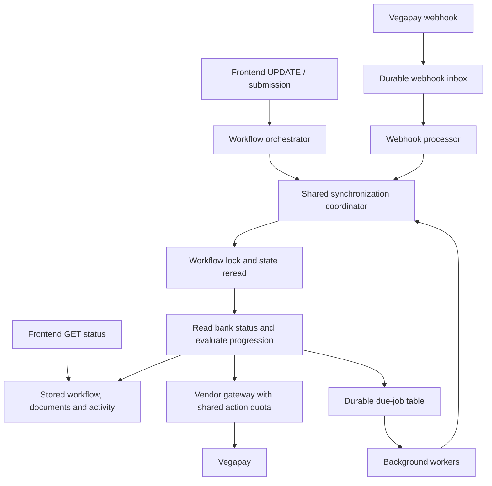

I’ll explain the design we’ve reviewed, with emphasis on where activity and rate limits are updated and what happens when multiple triggers reach the same workflow. No code changes are needed.

The design separates three controls: activity decides which journeys get background work, scheduling decides when it runs, and the shared action quota decides whether a Vegapay action can be called. The workflow lock coordinates state changes; it does not replace those controls. Activity is scoped to the onboarding workflow, so workers and callbacks cannot keep a user “active” indefinitely.**Your hybrid layer has three triggers—frontend updates, background jobs and webhooks—but one backend policy for deciding how the workflow progresses.**

In [systemdesign2.md](C:/Users/yashg/IdeaProjects/first_project/systemdesign2.md:63), that layer is proposed. Your current [WorkflowOrchestrator.java](C:/Users/yashg/IdeaProjects/first_project/src/main/java/org/example/service/WorkflowOrchestrator.java:123) implements input handling followed by one immediate progression opportunity. Activity tracking, durable jobs and shared action admission are proposed additions; locking and the VKYC webhook are assumed baseline capabilities.

**1. Where the hybrid layer sits**



The triggers carry different reasons for running:

| Trigger | Purpose |
|---|---|
| Frontend submission | Save input and attempt immediate progress |
| Frontend pending update | Refresh progress while the screen is active |
| Background worker | Reconcile eligible journeys after the user leaves |
| Webhook | Process a partner notification, including for inactive users |

**The worker calls the shared service directly.** It does not construct a fake frontend request or duplicate the state-handler logic.

Conceptually, the common entry point is:

```text
synchronize(workflowId, trigger)
```

It resolves `applicationId`, current local state and stored input from the backend’s mapping.
**2. What happens on frontend requests**

For **GET status**:

1. Resolve the user’s workflow.
2. Refresh foreground activity.
3. Return the saved workflow state and its screen data.

GET does not call Vegapay or advance business state in this design.

For **UPDATE with input**:

1. Refresh foreground activity.
2. Acquire the workflow lock and reread current state.
3. Validate and process input for the expected stage.
4. Persist the input and applicable local transition.
5. Run one immediate progression opportunity.
6. Return the latest saved state and screen data.

PAN retains its synchronous validation rule. Limit submission retains its requirement for salary input.

For **UPDATE without input**, the coordinator checks current pending progress. It does not reopen a form merely to make another synchronization attempt.

The immediate progression opportunity normally means **one status read and at most one permitted action**. The entire HTTP request can contain additional calls already made by its input handler.

**3. How user activity is tracked**

The current design stores activity **per onboarding workflow**:

```text
workflow_id
last_foreground_at
active_until
```

Its definition is:

```text
active_until = last authenticated GET/UPDATE time + 12 hours
```

Because your model permits one eligible active bank journey per customer, this represents that customer’s activity **in that journey**. Browsing an unrelated app screen does not refresh it.

The activity update belongs in the GET/UPDATE service entry path, after resolving ownership, before waiting on slow partner work. Use server time and an atomic maximum timestamp update so an older concurrent request cannot move activity backward.

| Event | Refresh activity? |
|---|---|
| User opens the workflow screen and calls GET | Yes |
| Frontend submits input | Yes |
| Frontend polls UPDATE | Yes |
| Worker checks Vegapay | No |
| Webhook arrives | No |

That last distinction matters: if workers refreshed activity, they would keep their own applications eligible forever.

For example:

- Last frontend request: **10 AM**.
- Background eligibility expires: **10 PM**.
- The user closes the app at 10:05 AM.
- Workers can continue during that window.
- After 10 PM, routine background polling stops.
- A webhook can still reconcile completion.
- A returning user refreshes activity and resumes synchronization.

Twelve hours is a chosen product policy. It means **recently active**, rather than currently on screen.

**4. How background polling is scheduled**

Background eligibility requires all of these:

```text
local state is EKYC_PENDING or VKYC_PENDING
AND activity has not expired
AND required input exists
AND the journey is not terminal or blocked for investigation
```

Activity alone never authorizes a bank action.

When a journey becomes eligible, persist one due-job row alongside the related local state update:

```text
workflow_id          // unique: one current job per workflow
expected_state
job_generation
due_at
unchanged_count
lease_until
claim_token
```
`due_at` controls when work becomes available. A worker claims the row with a short lease and a unique claim token.
Each execution:

1. Claims a due job.
2. Acquires the workflow lock.
3. Rereads state, activity and job generation.
4. Drops stale or ineligible work.
5. Performs one bounded synchronization step.
6. Persists the result and schedules or cancels subsequent work.
7. Releases the lock.

The worker does not sleep while holding the lock. Waiting is represented by another `due_at`.

The proposed polling cadence is:

| Unchanged processing stage | Background intervals |
|---|---|
| EKYC | Approximately 30 seconds → 60 seconds → 120 seconds |
| VKYC | Approximately 5 minutes → 10 minutes → 20 minutes → 30 minutes |

These are configurable design defaults. Add jitter to routine checks; do not schedule an action before its quota or retry deadline.

Frontend requests renew activity but should not create another job every three seconds or repeatedly reset an existing job’s due time.
`job_generation` prevents an old execution from deleting a newer scheduling decision. The claim lease allows recovery when a worker dies. Neither guarantees exactly-once remote execution; recovery still starts from current local and partner state.

**5. How Vegapay action limits are enforced**

Your design models the limit as:

> **Five admitted attempts per rolling hour, per stable customer, per action API.**

The rolling-hour interpretation is a design choice; it is not a verified historical implementation detail.

An illustrative Redis key is:

```text
vegapay:quota:<stableCustomerId>:<actionApi>
```

For example:

```text
vegapay:quota:customer123:EKYC_GENERATE_URL
```

Use the stable customer identity. A new application or workflow must not reset the allowance.

Every outgoing action uses the same admission mechanism:

- Direct PAN validation.
- Direct limit submission.
- Actions selected during frontend polling.
- Worker actions.
- Callback-triggered actions.
- Technical retries.

**Enforce this in the shared vendor gateway, close to dispatch.** Limiting only inside the background worker or progression method would leave direct input-handler calls outside the policy.

For an action to be dispatched:

```text
current partner gate permits it
AND local prerequisites exist
AND retry policy permits it
AND shared quota admits it
```

These are separate checks. Vegapay being `PENDING` does not bypass quota.

A concrete implementation of the document’s atomic reservation is a Redis sorted set:

```text
member = unique dispatchAttemptId
score  = reservation timestamp
```

One Lua script:

1. Removes reservations outside the preceding hour.
2. Checks whether this dispatch attempt was already reserved.
3. Counts current reservations.
4. Reserves a slot if fewer than five remain.
5. Otherwise returns the earliest possible retry time.

Redis sorted sets support scored members, and Lua execution provides an atomic boundary for the check-and-reserve operation. [Redis sorted sets](https://redis.io/docs/latest/develop/data-types/sorted-sets/), [Redis Lua scripting](https://redis.io/docs/latest/develop/programmability/eval-intro/)

For example, five attempts at 10:00, 10:05, 10:10, 10:15 and 10:20 block another at 10:25. The first reservation expires at 11:00. The caller still checks admission again when that time arrives.

Important accounting rules:

- Waiting for a lock does not consume a slot.
- Observing `IN_PROGRESS` does not consume an action slot.
- A dispatched request counts even if its response is lost.
- An uncertain reservation remains until expiry; a crash before sending may conservatively waste one slot.
- A new outbound retry gets a new dispatch attempt ID and consumes another slot.
- Repeating the reservation check for the same attempt must not double-count it.

**The attempt ID deduplicates quota bookkeeping, not Vegapay execution.** It does not replace a provider idempotency key.

If quota storage is unavailable, defer actions whose allowance cannot be accounted for.

Status GET has no reported API-specific quota in your contract. Its traffic is managed separately through worker cadence and bounded concurrency. Recovery getters follow whatever limits apply to those APIs.

**6. What happens when frontend, worker and webhook collide**

Consider VKYC completion:

1. Frontend update acquires the workflow lock.
2. It reads Vegapay and observes `Limit_Generate`.
3. It verifies the required local prerequisites.
4. It transitions `VKYC_PENDING → LIMIT_CREATION` and cancels routine pending work.
5. The waiting worker acquires the lock.
6. It rereads local state and drops its obsolete VKYC job.
7. A webhook processor later observes completion already applied and records a no-op.

All paths stop at salary input. None automatically generates a limit.

Alternatively, if frontend synchronization leaves the journey eligible and pending, the worker may acquire the lock afterward and make another status read. **Your primary design accepts that redundant read.**

Keep these controls distinct:

| Control | Responsibility |
|---|---|
| Workflow lock | Coordinate concurrent workflow execution |
| Database version check | Reject conflicting local commits |
| Job due time | Pace background checks |
| Activity expiry | Limit which journeys receive routine background work |
| Customer/action quota | Limit outbound action attempts |
| Vegapay state gate | Establish which partner action is currently applicable |

**7. Questions an interviewer can probe**

| Question | Defensible answer |
|---|---|
| Why poll when VKYC has a webhook? | Polling provides eligible-window reconciliation when notification processing is delayed or completion has not reached our local state. |
| Why not poll every pending application? | Routine workers are restricted to selected stages and recent foreground activity. |
| Does the worker make the bank finish faster? | It reduces our completion-detection delay; it does not accelerate bank processing. |
| What if the worker crashes after sending an action? | Another execution first reads current bank status. Applicable `PENDING` permits quota-limited retry; processing or later progress requires waiting or reconciliation. |
| What if GET status fails? | Preserve local state and schedule another observation. Do not submit using a guessed current bank state. |
| What if activity expires before VKYC completes? | Routine polling stops. Webhook processing or the user’s next visit can recover progress. |
| What if an old frontend poll arrives after a worker advances? | An input-free refresh returns current progress. A stale input submission must be handled as a conflict, not interpreted as input for the new stage. This is proposed behavior beyond the current orchestrator. |
| What if the lock expires during a bank call? | Detect ownership loss, avoid intentional stale commits and recover from current state. Locking alone does not establish exactly-once bank execution. |
| Can frontend polling bypass a worker’s quota deferral? | It can refresh status, but any resulting action still uses the shared allowance and retry eligibility. |
| What prevents unlimited status traffic? | Driver cadence and concurrency controls. The action quota does not limit status reads; shared status coalescing is an optional optimization. |

Your interview description can be:

> “The hybrid layer combined foreground updates, scheduled reconciliation and partner callbacks through one progression policy. Foreground requests renewed a twelve-hour activity window; workers never renewed it themselves. Eligible EKYC and VKYC journeys had durable scheduled jobs. Each execution reread local state under the workflow lock, fetched current bank status and decided whether to act, wait, reconcile or stop for input. Every outbound action shared a customer-and-API quota across all triggers. We kept scheduling, concurrency and action admission separate because each controls a different problem.”

Describe the workers and generalized recovery as proposed unless they were part of your actual production work.

> **This is another question where i asked what is to explain if we don't explain the hybrid sync layer**

I’ll check what your orchestrator actually owns, then separate what you can defend from what the interviewer is right about. The strongest answer will use concrete behavior and failure cases from your code.

Start subagent interview_defense

Complete subagent interview_defense

**You can defend the orchestration your service owns, but you should concede that hybrid polling alone does not make it platform-level work.** The interviewer may be right about the scope, even if “passthrough” understates the backend’s responsibilities.

My previous answer established that your design is reasonable. That does not automatically establish that it is a technically complex platform project.

**What you can defend from your actual code**

Your strongest examples are decisions your backend makes beyond forwarding a request:

| Situation | Decision your backend owns |
|---|---|
| Vegapay requests either address or EKYC verification | Execute the appropriate saved-input action while keeping the customer in one `EKYC_PENDING` stage |
| Vegapay reaches `Limit_Generate` | Open the salary-input screen; wait for that input before requesting limit generation |
| PAN validation declines synchronously | Keep the input stage available for correction |
| The next screen requires an EKYC/VKYC URL or offer data | Retrieve and save those artifacts before transitioning to that screen |
| An input submission enters a pending stage | Attempt one immediate progression step, then return the latest local state |

The salary example is especially useful. **The bank being ready for its next action does not mean your customer journey is ready to execute it.** Your backend owns that boundary.

That behavior is explicit in [VegapayProgressionService.java](C:/Users/yashg/IdeaProjects/first_project/src/main/java/org/example/service/VegapayProgressionService.java:44). The input-save-and-progress sequence is visible in [WorkflowOrchestrator.java](C:/Users/yashg/IdeaProjects/first_project/src/main/java/org/example/service/WorkflowOrchestrator.java:123).

These establish application orchestration. They do not establish a reusable workflow platform.

**How to explain the difficult part**

Leading with “we used Redis locks, polling and workers” invites the interviewer to evaluate familiar infrastructure components.

Lead with a concrete failure and the decisions required to recover:

> “We saved the customer’s addresses, submitted one to the bank, and lost the response. Our local journey remained pending while the bank advanced. On the next synchronization, we had to distinguish whether to retry the original action, submit the other address, wait for verification, or expose the next screen.”

Then explain your rules:

- Current actionable `PENDING` allows the corresponding submission, subject to prerequisites and quota.
- `IN_PROGRESS` means wait.
- A later milestone supports reconciliation only when the partner contract establishes the required preceding work.
- Missing response data must be retrieved before the next screen becomes available.
- Missing user input prevents proceeding across that input boundary.

That describes a recovery problem with explicit correctness conditions. “We keep both states synchronized” is too vague to expose those decisions.

Use this example as historical experience only if you actually implemented that recovery. Your prototype currently demonstrates stage-bounded progression; the fuller reconciliation behavior belongs to the design discussion.

**An answer you can give in the interview**

> “Yes, the bank owns verification, underwriting and its internal workflow. My scope was our customer onboarding journey across that process.
>
> Our local stages were not one-to-one copies of bank stages. One EKYC stage covered several bank actions, and reaching the bank’s limit-generation stage still required us to stop and collect salary input.
>
> We owned saved submissions, permitted local transitions and preparation of the next screen. The synchronization policy determined whether to submit an action, wait, recover missing results or stop for user input. Frontend polling, callbacks and the proposed background workers were triggers for that policy.
>
> I would describe this as a bank-specific onboarding orchestration service. I would describe it as platform work only where those capabilities were reusable across other journeys or integrations.”

Adjust “proposed” and “implemented” to match your actual experience.

**If they respond: “But those rules are still dictated by Vegapay”**

That is a fair observation. Many of your orchestration rules are consequences of the external contract.

You can say:

> “Agreed—the partner contract constrained the sequence. The engineering choices were how we represented customer progress, persisted input, recovered uncertain outcomes, and decided when a screen was ready. We did not own the bank’s business decisions.”

Then discuss **one choice you made and its tradeoff**, rather than adding more components:

- **Immediate progression after submission:** reduces an extra frontend round trip, but adds partner latency to the submission request. You bounded it to one step.
- **Frontend-triggered synchronization:** conserves background work, but local progress can remain stale while the user is absent.
- **Active-user workers:** improve recovery for recently active applications, but increase status traffic and leave inactive recovery dependent on callbacks or return visits.
- **Contract-based reconciliation:** works when later states provide sufficient evidence; requires additional result APIs when they do not.

Those are defensible decisions. Their significance depends on the failures, traffic and customer impact you actually encountered.

**If their objection is specifically “no platform-level contribution”**

Then do not try to make the service sound like a platform through terminology.

Platform-level evidence would be something multiple integrations or journeys actually consumed: shared provider adapters, reusable execution and recovery policies, workflow versioning, or common scheduling infrastructure. Creating a central poller within one bank service is useful refactoring, but it does not demonstrate that broader scope.

If your real work included the general onboarding, multi-bank eligibility or bank-handoff architecture described in `ProjectDetails.md`, discuss your concrete contribution there separately. Otherwise, this may simply be a narrower example than that interview requires.

The strongest defense is **a precise ownership boundary, one difficult failure scenario, and an implemented decision with a measurable effect**. If your contribution was mainly straightforward integration, acknowledge that scope and choose another project to demonstrate deeper platform engineering.

> This is the question what was you sync layer doing

It was basically managing three types of syncing
- failed status for the vegapay workflow state, other type of fail is vegapay api only fails and still in pending here the rate limit comes
- vegapay state begin moved ahead , or we lost response for the vegapay call and doesn't saved data at our end or do not make the state transition
- hybrid polling
- all three type of updaters frontend polling, vkyc webhook and the worker
- Each synchronization step checks current status before selecting an action

> How we handle the out of order webhooks for vkyc state updates
- it would be same out of order get status response like when webserver and frontend poll execute at same time and only one get the lock 
- No speculative PAN_VALIDATION_PENDING -> PAN_VALIDATION transition is added.
- The only reason we are able to execute one step in the user input api is because the next state for all input states are strict pending only  other wise if there would be case where after input state we have to show it's result directly and get acceptance from user then some pending state, or in short two input state consecutively
-  A full accepted/in-flight/unknown operation ledger is optional; it is not needed to implement the state-gated primary path. Shared nextSyncAt and resume markers are optional metadata described later.