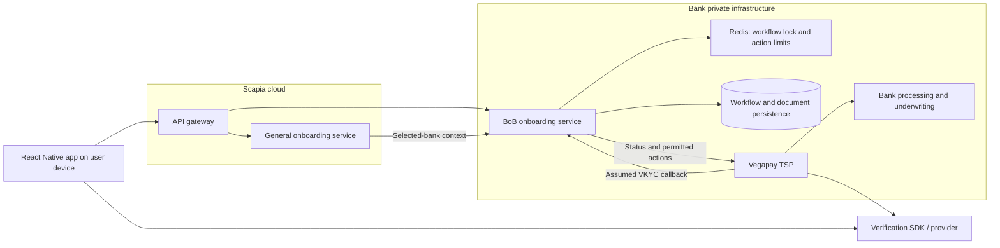
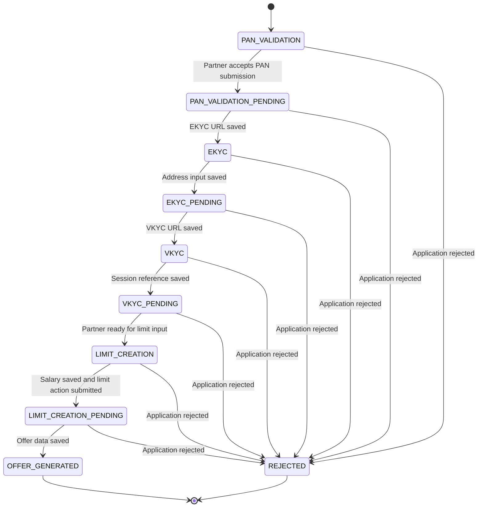
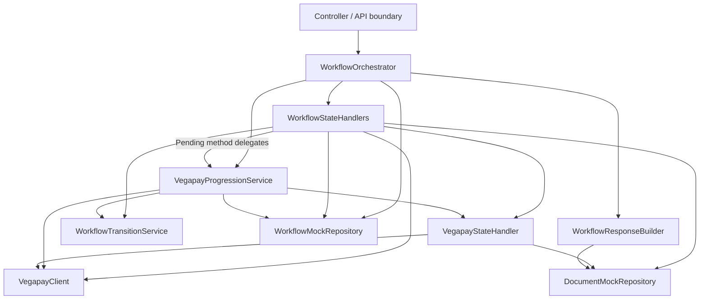
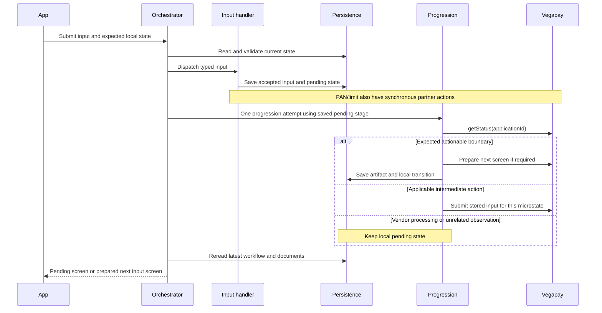

# System design 1: frontend-driven BoB onboarding orchestration

## 1. Purpose and evidence

This design explains the onboarding system described in [ProjectDetails.md](ProjectDetails.md), using the current Java prototype to make its state ownership and execution concrete. The engineering problem is to turn an asynchronous bank/TSP workflow into a resumable, deterministic user journey with explicit input boundaries.

Use these evidence labels throughout an interview:

| Label | Meaning in this document |
|---|---|
| Implemented | Observable behavior in the current prototype |
| Reported production context | Your description of the Scapia/BoB integration and partner contract |
| Baseline assumption | Redis workflow locking and a VKYC webhook, explicitly assumed for this design |
| Modeled infrastructure | Relational persistence and operational controls representing the production architecture, rather than the in-memory prototype |

The shared one-step progression service was recently added to this prototype. Describe it as a concrete reconstruction/refinement when discussing historical implementation. The background scheduler, database version checks, durable action ledger, and comprehensive reconciliation policy belong to [design 2](systemdesign2.md).

### Interview opening

> I worked on the bank-specific onboarding engine that converted Vegapay's asynchronous workflow into our application's user journey. The backend owned accepted input, permitted partner actions, local transitions, and the data needed to render the next screen. Frontend updates triggered reconciliation, while a VKYC callback could advance the journey independently. We serialized mutations per workflow and applied partner action limits.

Explain the trigger mechanism honestly: the baseline has demand-driven synchronization and an assumed VKYC callback. It does not claim continuous polling of all applications.

## 2. Requirements and system boundary

### Functional requirements

1. Verify a user's profile and eligibility in general onboarding; present eligible partner banks.
2. Hand a selected BoB journey to the bank-specific onboarding engine without duplicating an active application.
3. Register the customer with Vegapay and associate its application with our workflow.
4. Collect PAN details, EKYC/address details, a VKYC session reference, and salary input at the appropriate screens.
5. Perform vendor actions only when the current local stage has the necessary input and the vendor requests that action.
6. Show waiting screens during asynchronous verification, resume after app closure, and display the sanctioned offer.
7. Handle vendor rejection and allow user correction of retryable input failures.

The broader product journey in ProjectDetails includes offer acceptance. The prototype ends at `OFFER_GENERATED`; acceptance and downstream card issuance are outside its implemented state machine. Bank underwriting is represented through the partner interaction around limit creation, rather than a separate local underwriting enum.

### Architectural goals

Maintain local journey correctness despite vendor latency, avoid repeated collection of accepted input, protect partner APIs, serialize competing updates, and expose screen-ready domain responses. No production throughput or availability measurements are available in the supplied materials; do not invent them.

### Domain ownership

| Owner | Responsibilities |
|---|---|
| General onboarding service | OTP/profile journey, identity checks, consented soft bureau check, eligibility/BRE evaluation, bank selection and handoff |
| BoB onboarding service | Local workflow, input documents, partner action selection, state projection, response preparation and resumption |
| Vegapay and bank systems | Bank application state, dedupe, partner verification coordination, hard inquiry/underwriting and sanction decisions |
| Verification SDK/provider | User verification interaction and external processing |
| Mobile app | Displays the backend state, collects requested input and triggers status/update calls |

The backend does not infer bank approval from a successful form submission. Bank decisions and accepted local user input are separate facts.

## 3. High-level architecture

The deployment below follows the supplied production context. The mobile app executes on the user's device; Scapia's API/backend infrastructure sits in its cloud environment.



An authenticated identity and server-side application mapping should determine the workflow that may be accessed. The prototype DTO carries `applicationId`, but ownership of the persisted mapping remains a backend responsibility in the modeled architecture.

## 4. Identity and persistence

### Production context and prototype representation

The reported business rule is one stable customer identity per mobile number, with multiple historical workflows but at most one active or completed journey under the stated eligibility rules. An active general workflow maps to one initiated bank workflow. Reapplication after discard uses the described 30-day policy.

| Concept | Current Java representation | Modeled persistence |
|---|---|---|
| Workflow | `WorkflowEntity`: workflowId, userid, applicationId, workflowState | Workflow row keyed by workflow_id, linked to customer and vendor application |
| User-to-journey lookup | `UserWorkflowMappingEntity`: mobileNo, workflowId, applicationId, status, timestamps | Customer/workflow mapping with active-workflow uniqueness enforcement |
| Step data | `DocumentEntity`: documentId, workflowId, workflowState, documentDetails | Step record keyed by workflow/state, with typed payload stored as JSON |
| Typed payloads | PAN, EKYC, VKYC, salary and offer document classes | State-specific validation and serialized documents |
| Repository access | Mock repositories using in-process maps | Relational storage in the production model |

The mock repositories demonstrate lookup and state ownership. They do not provide durability across process restart or database transaction guarantees.

Logical step storage is `{workflow_id, state_name, payload_json}`. A user revisiting a screen should load the associated step data; an accepted input should not depend on the app retaining its original request.

General handoff needs the stable customer/general-workflow reference, selected bank, and relevant validated profile/consent context. The current creation DTO contains only mobile number and name; the full handoff is production context rather than an implemented general onboarding service in this repository.

## 5. Two state machines and their contract

### Local state machine



`WorkflowTransitionService` declares the forward edges. Rejection is assigned explicitly in handlers/progression rather than being one of those forward edges. Input states represent a user boundary; local pending states represent accepted input awaiting backend/vendor progress.

### Vendor status is different from local pending

| Vendor status | Reported contract | Current progression behavior |
|---|---|---|
| `PENDING` (`PNEDING` in the enum) | The vendor requires an action from us | Dispatch only a permitted stage action or complete the current boundary |
| `IN_PROGRESS` | Vendor/verification provider is processing | Leave the local pending state unchanged |
| `FAILED` | Retry or correction may be possible, depending on the reason | Generic progression leaves the local state unchanged; detailed classification is proposed in design 2 |

`Application_Rejected` is a vendor state and causes local rejection independently of the vendor status. `FAILED` alone is not equivalent to business rejection.

### Vendor projection and stop boundaries

| Local stage | Relevant vendor state(s) | Backend responsibility |
|---|---|---|
| `PAN_VALIDATION` | `PAN_VERIFIVATION` | Submit input synchronously; enter pending only after acceptance |
| `PAN_VALIDATION_PENDING` | `Ekyc_Url_Generated` | Retrieve/store URL, then enter `EKYC` |
| `EKYC_PENDING` | `Permanent_Address_Details`, `Current_Address_Details` | Submit the already saved address required by the observed state |
| `EKYC_PENDING` | `Ekyc_Verification` | Submit verification action when requested |
| `EKYC_PENDING` boundary | `Vkyc` | Generate/store VKYC URL, then enter `VKYC` |
| `VKYC_PENDING` | `Vkyc_Agent_Verification` and other processing observations | Wait for external completion |
| `VKYC_PENDING` boundary | `Limit_Generate` | Enter `LIMIT_CREATION`; collect salary before limit generation |
| `LIMIT_CREATION` | `Limit_Generate` | Save salary and call the limit action |
| `LIMIT_CREATION_PENDING` | `Offer_Generated` | Retrieve/store offer, then enter `OFFER_GENERATED` |
| Any eligible ongoing stage | `Application_Rejected` | Mark `REJECTED` |

`RE_Ekyc_Verification` exists in the vendor enum and its handler, but the current stage-aware progression does not define that recovery path. Design 2 specifies how to treat it. Observations of the two address states select the corresponding action; enum order is not the execution plan.

## 6. Low-level code structure



| Component | Decisive responsibility |
|---|---|
| `WorkflowOrchestrator` | Create/resume lookup, stale-request validation, input dispatch, one progression attempt and latest response |
| `WorkflowStateHandlers` | Read state-specific input, persist documents, submit synchronous actions where needed, enter pending |
| `VegapayProgressionService` | One status observation, validate stop boundary, dispatch a permitted intermediate action or prepare/complete the next stage |
| `VegapayStateHandler` | Adapt stored domain data to a vendor action and store returned screen artifacts |
| `WorkflowTransitionService` | Explicit allowed local forward transitions |
| `WorkflowResponseBuilder` | Return EKYC URL, VKYC URL or offer limit according to the persisted local state |
| `VegapayClient` | Vendor interface: registration, status, PAN, addresses, verification, URL and limit methods |
| `VegapayHttpClient` / mock clients | Transport/mock seam; not a separate owner of workflow policy |
| Repositories and typed documents | Workflow identity/state and state-specific saved data |

The older generic `handleVegapayState` dispatcher remains in the code. The current orchestrated progression uses stage-aware dispatch, because vendor readiness alone does not prove that all local input for the next action exists.

### The important orchestration decision

This excerpt is from [WorkflowOrchestrator.java](src/main/java/org/example/service/WorkflowOrchestrator.java):

```java
WorkflowState currentState = workflowEntity.getWorkflowState();
if (vegapayProgressionService.isPending(currentState)) {
    vegapayProgressionService.pollVegapay(
            vegapayProgressionService.stopStateFor(currentState),
            workflowEntity.getWorkflowId(), workflowEntity.getApplicationId());
}
return buildResponse(workflowEntity.getWorkflowId());
```

It executes after optional input dispatch. Accepted input has already changed the local state to pending. The same function therefore handles a fresh submission and a later frontend pending update without reading input twice.

**One progression step means one vendor status read and at most one vendor action inside the progression service.** It does not mean the entire submission request has only one external call. PAN and limit input handlers already perform their own partner interactions.

The response may remain pending, or it may contain a prepared next screen. There is no executor, sleep, or sequential retry loop in the current implementation.

### Completion includes preparation

In [VegapayProgressionService.java](src/main/java/org/example/service/VegapayProgressionService.java), observing a target state is followed by its required screen preparation:

```java
case Ekyc_Url_Generated -> {
    stateHandler.handleEkyc_Url_Generated(applicationId, workflowId);
    yield WorkflowState.EKYC;
}
case Limit_Generate -> WorkflowState.LIMIT_CREATION;
```

The first boundary stores the URL. The second deliberately performs no limit-generation action because salary input is required next. `stopState` is validated against the current local pending stage before dispatch.

[WorkflowResponseBuilder.java](src/main/java/org/example/service/WorkflowResponseBuilder.java) loads the prepared document after the orchestrator rereads the latest saved state. This is domain projection: vendor microstates are converted into the data and state required by a screen.

## 7. API and end-to-end flows

These are logical API contracts using the route terminology from the discussion. The repository's controller is a minimal stub; the implemented orchestration methods, not complete HTTP endpoints, demonstrate these flows.

| Operation | Input | Responsibility |
|---|---|---|
| Create workflow | Mobile/name; broader handoff context in production | Reuse an eligible journey or register and create a bank workflow |
| GET workflow/status | Workflow identity | Return persisted state and its screen data without progressing Vegapay |
| UPDATE workflow/status: input | Workflow identity, expected state, typed payload | Accept applicable input, transition, then attempt one progression step |
| UPDATE workflow/status: pending | Workflow identity and expected pending state | Attempt one progression step, then return latest state |
| VKYC callback, assumed | Vendor application identity and completion evidence | Under the shared lock, advance eligible `VKYC_PENDING` to local `LIMIT_CREATION` |

The response DTO currently contains workflowId, workflowState, ekyc_url, vkyc_url and limit_alloted. The expected request state is a concurrency/staleness check, not a command permitting arbitrary transitions.

### Frontend entry and return

On initial screen entry the frontend calls GET, then an update as appropriate. While the response remains pending and the screen is active, it repeats UPDATE approximately every three seconds. An update without input leaves an input state unchanged. On return, GET reloads the current state; if pending, frontend updates resume.

If a webhook has already advanced the workflow, GET renders the next input screen. If a webhook was missed, a later pending update can observe the vendor boundary. In the baseline there is no continuous completion-freshness guarantee after the app closes.

### Input submission and immediate progression



This diagram describes logical persistence ordering. The mock repository writes are not an atomic database transaction. PAN saves the submitted document before partner acceptance and transitions only on acceptance; a decline leaves the user at its input boundary.

### VKYC webhook and frontend race: baseline assumption

Both paths acquire `lock:bob:workflow:{workflowId}` with an owner token, then reread the workflow. Lock acquisition precedes the state-dependent decision. A handler releases only its own lock; acquisition has a bounded wait and the lease must cover the bounded operation or be renewed while ownership is valid.

```mermaid
sequenceDiagram
    participant Front as Frontend update
    participant Hook as VKYC webhook
    participant Lock as Workflow lock
    participant DB as Workflow store
    Front->>Lock: Acquire workflowId lock
    Hook->>Lock: Attempt same lock; wait/defer
    Front->>DB: Reread VKYC_PENDING
    Front->>DB: Apply confirmed readiness: LIMIT_CREATION
    Front->>Lock: Release own lock
    Hook->>Lock: Acquire
    Hook->>DB: Reread LIMIT_CREATION
    Note over Hook,DB: Completion already applied: no transition
    Hook->>Lock: Release own lock
```

If the webhook wins first, the frontend sees the newer state under the lock. Duplicate completion after local advancement must not overwrite salary input or generate a limit. The current prototype rejects stale frontend expected-state requests; the client reloads via GET. Design 2 improves the explicit response/reconciliation policy.

A lock prevents overlapping well-behaved owners while its lease is valid. It does not make a remote call plus a local write atomic, or guarantee exactly-once execution after a crash or expired lease.

## 8. Rate limits, retries and failure semantics

The reported action limit is **five calls per hour per user per action API**. For documentation, model a rolling window; the historical window implementation was not established. Key by stable user/customer identity and action API, not just workflowId. A new workflow must not reset the same user's allowance. Technical retries consume action calls too.

The vendor status GET has no reported API-specific limit. The baseline can make frequent status reads while a user is on screen, but an actionable `PENDING` response does not authorize unlimited action dispatches. Rate limiting belongs at the common outbound action boundary, so direct input submissions and progression use the same accounting. It is reported production behavior, not implemented quota code in this prototype.

| Situation | Baseline explanation |
|---|---|
| Partner accepts PAN | Transition to pending, then one immediate progression attempt |
| PAN decline requiring corrected data | Remain at the input boundary; user supplies a new submission subject to the action cap |
| Vendor `IN_PROGRESS` | Return saved pending state; frontend schedules its next update |
| Vendor `FAILED` | Failure may be recoverable; generic classified retry machinery is not implemented here |
| Action quota exhausted | Modeled contract defers the action and exposes waiting/retry information; do not change it into business rejection |
| Vendor call fails after accepted local input | Resume from stored pending state on a later update; do not require the form again merely to trigger synchronization |
| Partner succeeded but local completion was not recorded | Outcome is ambiguous; Redis alone cannot prove whether an action can safely be repeated |
| App closes, callback absent | Local pending state may remain stale until the next foreground update |

The user-described corrected PAN retry is a business correction flow. It is distinct from repeating an identical request after a network timeout. The repository's declined branch and payload model illustrate the boundary, not a complete production error-response/retry implementation.

The one extra step trades slightly longer submission latency for sometimes avoiding another frontend round trip. It does not wait until an hours-long VKYC process finishes. A failure in this extra step should not undo an already durable accepted input in the production design; whether to return a pending response or an error is an explicit transport policy, not a guarantee of the current code's exception behavior.

## 9. Data handling and operations

The stated data boundary keeps raw Aadhaar interaction in the verification SDK/provider path and stores references/status in onboarding. Keep identity payloads out of operational logs; retain consent, timestamps, source and correlation references in the production audit design. Card credentials, embossing and activation belong to downstream services. These are architectural boundaries, not a claim of compliance certification.

Useful operating signals are local stage age, vendor state/status, progression trigger, action dispatch count, quota deferrals, webhook duplicates, lock contention and status/action latency. An audit entry should explain which observation caused a transition and which input revision was used. These controls are modeled operational expectations rather than existing prototype telemetry.

## 10. Decisions and tradeoffs to defend

| Decision | Reason | Cost or limit |
|---|---|---|
| Backend domain states separate from vendor states | Stable UI and explicit input boundaries | Must maintain a mapping as partner behavior changes |
| Frontend-triggered progression | Demand follows engaged users; idle applications do not generate polling traffic | App closure limits freshness except for callbacks |
| One step after submission | Reuse saved input and potentially return the next screen immediately | Additional partner latency in the submission request |
| Explicit stage stop boundary | Prevent executing an action requiring fresh user input | A generic unrestricted dispatcher cannot be used blindly |
| Workflow-scoped Redis lock | Serialize frontend/callback mutations across service instances | Lease and crash limits remain |
| Action API quota | Protect contractual partner limits | May defer a ready action despite an active screen |
| Saved-state response builder | Resume and render from backend-owned data | Required artifacts must be prepared before transition |

The complexity to emphasize is the coordination of two state machines, accepted-input boundaries, asynchronous progress, screen preparation, concurrent mutations and partner constraints. Do not add infrastructure purely to make the description sound complex.

## 11. Interview grilling

Answer each prompt aloud before reading its checkpoint.

1. **?The frontend calls an API. Where is the backend orchestration??** Explain that the trigger does not select arbitrary vendor actions. Show persisted input, stage-scoped action selection, the stop boundary, permitted transitions and artifact hydration.
2. **?Why not return immediately after saving input??** Explain the one-step opportunity, bounded work, the extra latency and continuation from pending if unfinished.
3. **?Does a single step mean a single HTTP request to the bank??** No. Progression has one status read and at most one action; the input handler can already have its own vendor calls.
4. **?Vegapay says Limit_Generate/PENDING. Why don't you generate the limit??** Readiness requests an action, but local salary prerequisites are absent. Advance to `LIMIT_CREATION` and stop for input.
5. **?Two frontend calls and a webhook arrive together. Who wins??** Same workflow lock, reread under ownership, apply only an eligible transition; stale frontend reloads, duplicate callback becomes a no-op.
6. **?You took a Redis lock. Does that guarantee exactly-once partner calls??** Explain lease expiry and crash after partner acceptance. A lock alone cannot resolve the remote outcome.
7. **?What happens when the user closes the app??** Callback may advance VKYC; otherwise local freshness waits for return. Explain this baseline limitation directly.
8. **?Does FAILED mean the application is rejected??** No. Distinguish recoverable vendor failure from `Application_Rejected` and from corrected PAN input.
9. **?Why are there separate states on your side??** Stable screen/input semantics consolidate vendor microstates; the backend owns a projection rather than copying the vendor enum.
10. **?How is the five-call limit scoped??** Per stable user and action API over the modeled hour window, shared across input and progression. Status reads are separate.
11. **?What if the vendor skipped your expected state??** Baseline exact-boundary logic does not implement comprehensive recovery. Describe the compatibility/reconciliation extension in design 2 without claiming it was already deployed.
12. **?What evidence can this prototype demonstrate??** Explain the six existing behavior tests and source paths below; distinguish mock-state persistence from production durability.

## 12. Validation and source map

The existing [WorkflowProgressionTest](src/test/java/org/example/service/WorkflowProgressionTest.java) covers prepared next-screen response after PAN, input-free screen entry, stopping before salary, one intermediate action without another read, invalid stop boundary, and rejection independent of vendor status.

Key sources:

- [WorkflowOrchestrator](src/main/java/org/example/service/WorkflowOrchestrator.java), [WorkflowStateHandlers](src/main/java/org/example/service/WorkflowStateHandlers.java), [VegapayProgressionService](src/main/java/org/example/service/VegapayProgressionService.java).
- [WorkflowTransitionService](src/main/java/org/example/service/WorkflowTransitionService.java), [WorkflowResponseBuilder](src/main/java/org/example/service/WorkflowResponseBuilder.java).
- [VegapayStateHandler](src/main/java/org/example/vegapay/statehandlers/VegapayStateHandler.java), [VegapayClient](src/main/java/org/example/vegapay/client/VegapayClient.java).
- [Local states](src/main/java/org/example/dto/WorkflowState.java), [vendor states](src/main/java/org/example/vegapay/VegapayWorkflowState.java), [vendor statuses](src/main/java/org/example/vegapay/VegapayWorkflowStateStatus.java).
- [WorkflowEntity](src/main/java/org/example/model/entites/WorkflowEntity.java), [DocumentEntity](src/main/java/org/example/model/entites/DocumentEntity.java), [UserWorkflowMappingEntity](src/main/java/org/example/model/entites/UserWorkflowMappingEntity.java).

No Redis, webhook or background-worker implementation is asserted by these source links. The first two are explicit baseline assumptions; the worker is an extension in design 2.
