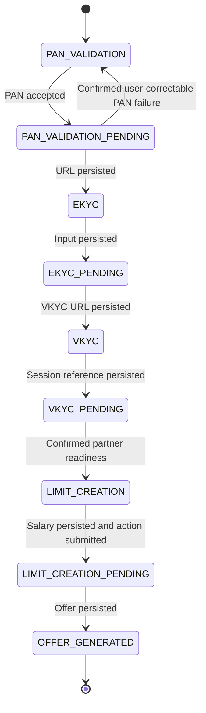

# System design 2: hybrid synchronization, reconciliation and recovery

## 1. Purpose, provenance and interview framing

This is a proposed evolution of the BoB onboarding prototype and the reported Scapia integration. It combines foreground updates, active-user background work and VKYC webhooks through a shared synchronization policy. It is an architecture specification, not a claim that these workers, database tables or recovery policies are already implemented.

The baseline code still provides the domain foundation: input handlers, typed documents, explicit local transitions, stage-aware one-step progression and response preparation. [Design 1](systemdesign1.md) explains that implementation. [ProjectDetails.md](ProjectDetails.md) supplies the wider product/deployment context. This document repeats the important boundaries so it can be read independently.

### Interview opening

> The core problem was reconciling our resumable onboarding state with an asynchronous bank workflow. In the baseline, foreground updates and a VKYC callback triggered that process. My proposed extension gives recently active applications a scheduled reconciliation path, while keeping all triggers behind one state policy, one scheduling decision and shared action limits. It also specifies stale-observation handling, crash recovery and classified retries.

Use ?implemented,? ?assumed baseline,? and ?proposed extension? precisely. The sophistication comes from clear ownership and failure semantics; it does not require describing a proposed feature as historical experience.

## 2. Requirements and chosen policies

### Product and ownership

General onboarding owns OTP/profile verification, consented soft bureau checks, bank eligibility and selection. Selecting BoB hands context to the bank engine. That engine owns persisted input, the application mapping, domain transitions, vendor actions and screen data. Vegapay/bank systems own verification and underwriting outcomes.

The larger product journey includes offer acceptance. The prototype's terminal success state is `OFFER_GENERATED`; no new acceptance or underwriting enum is invented here. Card issuance/activation belongs to downstream services. The mobile app executes on a device; the reported backend topology places general onboarding in Scapia cloud and BoB onboarding/Vegapay within bank infrastructure.

### End-to-end product journey

| Stage | Owned behavior |
|---|---|
| General onboarding | Mobile/OTP, name/DOB/PAN capture, identity verification, consented soft bureau check, multi-bank BRE eligibility and bank selection |
| BoB registration | Carry selected-bank context and consent references; register with Vegapay; bind vendor applicationId to local workflow |
| PAN/dedupe | Submit bank confirmation input; accepted result enters pending, correctable decline remains at input |
| EKYC/address | Save current/permanent address and collect SDK verification references; submit requested vendor microstate actions |
| VKYC | Store launch data and session reference; reconcile asynchronous agent/provider completion through polling or callback |
| Limit/underwriting | Stop for required salary input, submit the allowed bank action and observe partner underwriting/sanction |
| Offer | Hydrate/display sanctioned limit; prototype ends at OFFER_GENERATED, while broader product acceptance is outside its enum |

The reported identity rule is one stable customer identity per mobile number, historical rejected/discarded workflows and one eligible active or completed journey at a time. General and initiated bank workflow have a 1:1 handoff mapping. Apply the described 30-day reapplication rule after discard; neither a new workflow nor a return visit resets the customer's action quota.

### Confirmed choices and design defaults

| Item | Policy | Provenance |
|---|---|---|
| Active user | Authenticated GET or UPDATE workflow call in the preceding 12 hours | User-confirmed choice |
| Worker eligibility | Active application in `EKYC_PENDING` or `VKYC_PENDING` | Proposed worker scope |
| Frontend refresh | Existing roughly three-second pending refresh can continue | Reported frontend behavior |
| Partner action cap | Five calls per hour per stable user per action API | User-reported contract |
| Window implementation | Rolling hour, every dispatched attempt counted | Explicit modeling default |
| Partner status cap | No reported API-specific cap on `getStatus` | User-confirmed contract |
| VKYC webhook | Assumed baseline capability; independent of user activity | User-confirmed assumption |
| Mutation lock | Same deterministic Redis workflowId key for every trigger | User-confirmed assumption |
| Inactive recovery | Webhook or next foreground visit; no routine inactive polling | User-confirmed choice |
| Work queue | Durable due-job table and scheduled workers | Proposed prototype-friendly implementation |
| Partner idempotency/event ordering | Not established by the supplied contract | Do not assume guarantees |

An active user is not necessarily on screen now. A user who closed the app eleven hours ago is still active under this policy. That is intentional and must be included in the polling cost discussion.

### Correctness and liveness goals

Persist accepted input before relying on later synchronization; apply only permitted local transitions; prepare screen artifacts before exposing the next screen; prevent concurrent local overwrites; avoid known duplicate external actions; honor the action cap across all drivers.

Background freshness is conditional on active eligibility, partner availability, scheduling and quotas. There is no unconditional freshness guarantee for an inactive application whose webhook never arrives. Returning users initiate reconciliation even after the activity window expires.

## 3. High-level architecture


All state-changing paths use the same coordinator and transition rules. A worker has no independent implementation of the workflow. The webhook ingress first preserves delivery; subsequent processing uses that same policy.

One worker invocation performs a bounded step and schedules another due job if appropriate. It does not sleep for minutes or hold a lock across a backoff interval. Delayed work is represented as data.

## 4. Local state, vendor projection and completion boundaries



Rejection is an explicit terminal business outcome available during an ongoing application. Recovery status is additional metadata. The one backward edge shown is a narrowly guarded PAN correction policy; undocumented partner recovery does not authorize arbitrary reversal of the journey.

| Local stage | Vendor enum / work | Completion boundary |
|---|---|---|
| `PAN_VALIDATION` | `PAN_VERIFIVATION`: submit validated PAN/DOB; correction is a new input revision | Partner acceptance permits `PAN_VALIDATION_PENDING` |
| `PAN_VALIDATION_PENDING` | `Ekyc_Url_Generated`: obtain next EKYC URL | Store URL, then `EKYC` |
| `EKYC_PENDING` | `Permanent_Address_Details`, `Current_Address_Details`, `Ekyc_Verification`: submit stored prerequisites or requested verification | Remain pending while intermediate work runs |
| `EKYC_PENDING` boundary | `Vkyc`: obtain the VKYC launch URL | Store URL, then `VKYC` |
| `VKYC_PENDING` processing | `Vkyc_Agent_Verification`: observe external processing | Wait or reconcile the completion callback |
| `VKYC_PENDING` boundary | `Limit_Generate`: confirm partner readiness | Enter `LIMIT_CREATION` for salary input |
| `LIMIT_CREATION` | `Limit_Generate`: submit saved salary once allowed | Accepted action permits `LIMIT_CREATION_PENDING` |
| `LIMIT_CREATION_PENDING` | `Offer_Generated`: observe sanction/offer and hydrate data | Store offer, then `OFFER_GENERATED` |
| Ongoing eligible stage | `Application_Rejected`: confirmed business rejection | `REJECTED` and cancel routine jobs |
| Explicit EKYC recovery | `RE_Ekyc_Verification`: classify requested recovery | Recovery policy, not an inferred forward transition |

A stop boundary is a predicate over local prerequisites, current vendor evidence and required artifacts. The enum argument alone is not the proof of completion. At `Limit_Generate`, the action cannot be dispatched until salary exists. At `Vkyc`, saving the launch URL completes an EKYC stage but does not submit the VKYC user's session reference.

### Vendor status contract

| Status | Coordinator decision |
|---|---|
| `PENDING` / code `PNEDING` | Select the action for this vendor state, then check local stage, prerequisites, attempt identity and quota before dispatch |
| `IN_PROGRESS` | Submit no corresponding action; persist observation and schedule a later check |
| `FAILED` | Classify error/failed action; choose technical retry, user correction, explicit recovery or investigation |
| State `Application_Rejected` | Confirm the business outcome and apply local rejection; stop normal jobs |

Hours in VKYC processing can be normal according to the supplied experience. The stage age alone is not grounds for rejecting the application. `RE_Ekyc_Verification` is a specific recovery signal, not something to discard using a numerical state rank.

## 5. Low-level responsibilities and interfaces

Existing prototype roles remain recognizable:

| Component | Responsibility in the proposed design |
|---|---|
| `WorkflowOrchestrator` | Authenticate/resolve workflow, accept input, request immediate progression, build latest response |
| `WorkflowStateHandlers` | Typed input handling and durable local acceptance; preserve PAN's acceptance-before-pending exception |
| `VegapayProgressionService` | Foundation for the one-observation, stage-bounded decision |
| `WorkflowTransitionService` / proposed `RecoveryTransitionPolicy` | Normal domain edges plus the separately guarded PAN correction edge |
| `VegapayStateHandler` | Vendor action/artifact adapters; policy stays outside the transport |
| `WorkflowResponseBuilder` | Render a committed local state with stored screen data |
| `SyncCoordinator`, proposed | Common ownership, observation, recovery, action and transition application for all drivers |
| `ActivityTracker`, proposed | Atomically refresh activity using authenticated foreground calls only |
| `SyncJobRepository` and scheduler, proposed | Deduplicated due jobs, leases, retry/rescheduling and stale-job rejection |
| `ReconciliationPolicy`, proposed | Local/vendor compatibility, user prerequisites and artifact requirements |
| `ActionAttemptRepository` and quota gateway, proposed | Attempt identity, ambiguity and shared dispatch limits |
| `WebhookInbox`, proposed | Durable receipt, authentication outcome, deduplication and processing status |

Illustrative interfaces, not implemented code:

```java
enum SyncTrigger { FRONTEND_UPDATE, WORKER, WEBHOOK }

enum SyncOutcome {
    ADVANCED, ACTION_ACCEPTED, WAITING, DEFERRED,
    NEEDS_USER_CORRECTION, NEEDS_RECONCILIATION, TERMINAL
}

SyncResult synchronize(String workflowId, SyncTrigger trigger,
                       Optional<WebhookReceipt> receipt);

Decision decide(WorkflowSnapshot local, VendorObservation observed,
                Optional<ActionAttempt> currentAttempt);

QuotaDecision reserveAction(String customerId, String actionApi,
                            String dispatchAttemptId);
void schedule(String workflowId, WorkflowState expectedState,
              long scheduleGeneration, Instant dueAt);
```

These separate observation from the decision to dispatch a side effect. A status read should not bypass the action ledger merely because it returned `PENDING`.

## 6. Persistence and invariants

The mock repositories are replaced by relational persistence in this proposed design. This is a logical schema, not a migration supplied with this document.

| Record | Important fields and constraints |
|---|---|
| Customer/application mapping | stable customer_id, general_workflow_id, bank workflow_id, application_id; enforce the reported one-eligible-active-journey rule |
| Workflow | workflow_id, customer_id, application_id, local_state, version, last_vendor_state/status, last_observed_at, recovery_status, updated_at |
| Step document | workflow_id, state_name, payload_json, payload_revision; unique current document per workflow/state |
| Activity | workflow_id, last_foreground_at, active_until, resume_requested_at, resume_processed_at; use maximum timestamps so older requests cannot shorten the lease |
| Sync metadata | workflow_id, next_sync_at, unchanged_count, status_error_count, schedule_generation |
| Due job | workflow_id primary key, expected_state, schedule_generation, due_at, job_lease_until, claim_token |
| Action operation | operation_id, workflow_id, action_api, payload_revision, stage_generation, input_hash, status, vendor_reference, result_reference; unique logical operation identity |
| Action dispatch attempt | dispatch_attempt_id, operation_id, attempt_number, reserved_at, sent_at, outcome, retry_at, error_class; unique operation/attempt number |
| Webhook receipt | provider_event_id when available, application_id, received_at, payload_reference, processing_status; unique provider event identity when trustworthy |
| Audit | workflow/version, trigger, observation reference, old/new state, operation reference, timestamps and reason |

Use an index on due time for queue selection and indexes on vendor application mapping and receipt processing status. Capacity and retention are configuration choices, not undocumented production metrics.

Invariants:

1. A committed next-screen state has the artifacts that its response requires.
2. A local transition is based on the currently reread state and expected version.
3. All dispatches share the user/action quota, including corrected inputs and technical retries.
4. An accepted/in-flight/unknown operation is not blindly recreated by the next poll.
5. Worker execution and webhook delivery never refresh foreground activity.
6. A job never supplies missing user input or advances a completed journey through an old stage.
7. A durable receipt remains processable after an ingress acknowledgment.

Persist related document changes, workflow transition, audit and due-job updates in one local transaction where they form one committed result. The external vendor call is outside that local atomic boundary.

## 7. API behavior and submission flow

The logical public operations remain create, GET status and UPDATE status. No runtime API is changed by writing this document. If implemented, retain existing response fields and add optional synchronization metadata such as `lastSyncedAt`, `retryAfterSeconds`, `recoveryStatus` and an actionable reason. These are proposed fields, not current DTO contents.

GET returns local state, refreshes activity and records a resume request; it does not itself mutate the business state or call Vegapay. Its metadata write need not take the business workflow lock if performed atomically. UPDATE may accept input or request reconciliation. Both enforce ownership using the server mapping.

For a stale pending request without input, return the current state and artifacts rather than replaying the old stage. For a stale input submission, return a conflict plus the current journey; do not reinterpret its payload as input to a different stage. Repeated submission of the same previously accepted request can return its stored result when an input idempotency identity is available.

### One progression step after input remains

```text
Authenticate and resolve workflow
Acquire shared workflow lock; reread local state/version
Validate expected input state and typed payload
Accept/save input according to stage policy
    PAN: transition only after explicit partner acceptance
    Limit: preserve the required partner-action acceptance policy
    Other input stages: save prerequisites and transition to pending
Commit accepted pending state and input revision
Request one immediate progression step using the resulting pending stage
Build response from the latest committed local state
Release owned lock
```

The immediate progression request gets one due check after a new pending stage is committed; it still respects action quota and known operation state. It does not initiate an unbounded polling loop. A failure after accepted input preserves that acceptance and returns a pending/recovery response in the proposed transport policy, while unexpected programming errors remain errors.

This preserves the decisive [current orchestration behavior](src/main/java/org/example/service/WorkflowOrchestrator.java): input dispatch is followed by `pollVegapay(...)`, then response construction. A background job is an additional trigger, not a replacement for frontend updates.

## 8. Shared scheduling and active-user polling

### Eligibility

```text
activeUntil = most recent authenticated GET/UPDATE time + 12 hours
eligible = localState in {EKYC_PENDING, VKYC_PENDING}
           and now < activeUntil
           and workflow is not terminal
           and no blocking user-correction/investigation condition
```

Use the existing UI convention that GET runs on screen entry and UPDATE runs for subsequent polling. GET atomically sets `resume_requested_at` to the current time. The next coordinator call consumes that request once under the workflow lock, recording `resume_processed_at`; the worker may consume it too. This permits a fresh check on a return within the same 12-hour activity lease, rather than only after lease expiry. Multiple entry requests within 30 seconds of an observation coalesce into one deferred check. If a pending application becomes active again, GET and the next UPDATE also recreate any suspended due job.

A consumed resume request resets observation backoff for freshness, but not action-attempt identities, quota, technical retry deadlines or a recorded ambiguity. Routine three-second UPDATE calls refresh activity without creating resume requests or resetting backoff. Until a foreground update consumes the request, GET can return the previously saved state.

### Due-time defaults

| Stage/condition | Proposed configurable schedule |
|---|---|
| Newly entered pending stage | One immediate foreground progression opportunity |
| EKYC unchanged/processing | 30 s, 60 s, then 120 s maximum |
| VKYC unchanged/processing | 5 min, 10 min, 20 min, then 30 min maximum |
| Meaningful stage/vendor progress | Reset unchanged backoff; schedule the next permitted step |
| Foreground resume | Request a fresh check; coalesce if another observation occurred in the last 30 s |
| Technical failure | Classified retry deadline, capped attempt budget and backoff |
| Quota defer | Earliest permitted action time; avoid repeated status reads merely to rediscover the same quota block |
| Lease expiry or next input state | Remove/suspend routine worker job |

Use approximately +/-20% jitter for routine background checks. Do not jitter a quota or Retry-After deadline earlier. The cadence is a chosen design default, not a claim about measured vendor performance.

The coordinator evaluates shared `nextSyncAt` under the lock. Frontend and worker use the same due decision. A new stage or actual foreground resume can request an earlier check once; normal screen refresh cannot repeatedly force it. A webhook can request reconciliation immediately because it supplies a new event, but repeated equivalent webhook work is coalesced too.

A recently completed observation wins even if the worker job is already queued. The second caller rereads due metadata and returns saved state. This avoids turning two drivers into two independent streams of status calls.

### Durable worker execution

1. Claim a due row using a database lease and unique claim token.
2. Attempt the workflow lock; defer on contention without consuming an action quota slot.
3. Reread local stage, activity, recovery status, due time and schedule generation.
4. Drop work for expired activity, noneligible stage or stale generation; reschedule work that is no longer due.
5. Run one synchronization step; persist its result and next due job transactionally.
6. Complete/reschedule only the claimed generation/token, so a stale completion cannot delete a newer job.

The `version` protects workflow commits. `schedule_generation` identifies the current scheduling decision without making a job obsolete on every activity timestamp update. A process crash allows job-lease expiry and reclamation; repeated execution uses the same state/action policy.

With a broker later, commit a scheduling outbox alongside the local state, publish asynchronously and preserve the same consumer deduplication. The v1 database queue avoids introducing a DB/broker dual-write problem.

## 9. Coordinator algorithm and concurrency

Conceptual one-step pseudocode:

```text
synchronize(workflowId, trigger, receipt):
    acquire owned workflow lock with bounded wait
    reread workflow, metadata and applicable operation
    validate trigger eligibility
    if terminal/stale:
        finish any webhook receipt durably as no-op; return saved state
    consume any pending entry/resume request with 30-second coalescing
    if normal frontend/worker observation is not due: return saved state

    for unversioned webhook: use it as a wake-up hint
    obtain current authenticated vendor status when needed
    decide compatibility, required prerequisites and permitted action

    if waiting:
        persist observation and next due time
    if boundary ready:
        acquire any screen artifact through the guarded action gateway
        transaction: save artifact + CAS transition + audit + replace/remove job
    if action required:
        reconcile existing accepted/in-flight/unknown operation first
        if a new/retry dispatch is permitted:
            persist operation/dispatch intent with stable dispatchAttemptId
            reserve shared quota idempotently for that dispatchAttemptId
            perform bounded vendor call using stable idempotency key if supported
            transaction: record outcome + schedule verification/retry
    if failed/divergent:
        persist classified recovery and next allowed work

    mark webhook processed only when its result is durably applied/scheduled
    return latest committed response
finally:
    release only the owned lock
```

Every outgoing action, including screen URL acquisition and direct PAN/limit submission, goes through the guarded action gateway. Status reads have separate cadence/capacity protection.

### Lock and local commit

Use `lock:bob:workflow:{workflowId}` for foreground update, worker and webhook processing. Configure bounded vendor timeouts shorter than the usable lock lease; renew ownership for an in-flight bounded operation if supported. Do not retain the lock while waiting for the next scheduled attempt.

Local business updates also require compare-and-set version checking:

```sql
UPDATE workflow
SET local_state = :next_state, version = version + 1
WHERE workflow_id = :id
  AND local_state = :expected_state
  AND version = :expected_version;
```

A zero-row update means this proposed transition did not commit. Roll back its associated local writes and reread; do not retry the vendor side effect merely because the local CAS failed. Updates recording observations/recovery should use the same version discipline.

The lock reduces overlap. CAS rejects a commit if a competing write has changed the expected version/state; lock expiry alone does not change that version. Check ownership before intentional local commits and abort on detected loss, preserving the remote outcome for reconciliation. This check is not an unconditional database fencing guarantee: if hard fencing is required, add a database-enforced ownership generation. Neither the lock nor CAS fences an already-sent vendor call or gives exactly-once external execution. A recorded in-flight operation adds another guard if a second owner appears after lease expiry; it cannot remove every uncertain remote outcome.

### Worker/webhook completion race

```mermaid
sequenceDiagram
    participant W as Worker
    participant H as Webhook ingress
    participant I as Durable inbox
    participant C as Coordinator
    participant DB as Workflow store
    W->>C: Sync VKYC_PENDING
    C->>DB: Under lock: read current state/version
    H->>I: Persist authenticated event
    Note over H,I: Acknowledge only after receipt commit
    C->>DB: CAS transition to LIMIT_CREATION; cancel VKYC job
    I->>C: Process completion event
    C->>DB: Under same lock: reread LIMIT_CREATION
    C->>I: Mark duplicate/completed receipt processed
```

If the callback processor wins, the worker no-ops after rereading. Both outcomes stop at salary input. Neither performs limit generation just to prove that VKYC completed.

## 10. Webhook delivery, duplication and order

The repository has no documented webhook wire contract. Use the partner's agreed authentication mechanism; do not invent a particular signature algorithm as historical fact. Map vendor applicationId to the local workflow and validate that the event concerns that application.

Ingress authenticates, durably inserts the receipt and acknowledges after commit. A database failure is not a successful acknowledgment. Processing can then wait for the workflow lock or retry independently. Use a unique vendor event ID if trustworthy; if none is provided, state-level idempotency still handles repeated completion, but delivery-level deduplication is less precise.

Without a guaranteed vendor event sequence or version, a callback is a notification to reconcile current status. Its receive timestamp does not prove business-event order. Fetch current partner status before applying a potentially stale completion or failure. If the partner supplies trustworthy ordering/current-state evidence later, the adapter can use it to avoid unnecessary reads.

A callback can advance an inactive user. It does not grant that user a new 12-hour activity lease or authorize polling all subsequent stages while inactive. A late callback after offer generation must not regress the local state.

## 11. State mismatch and reconciliation policy

Keep three problems distinct: client staleness, observation staleness and real local/vendor divergence.

| Case | Proposed decision |
|---|---|
| Frontend expected state is old, no payload | Return latest committed state; reconcile only from the current stage |
| Old input payload arrives after advancement | Conflict/current-state response; never replay it as another stage's input |
| Vendor asks for another action within EKYC | Use stage compatibility and saved prerequisites; address enum order does not matter |
| Expected boundary reached | Prepare required artifact, then apply allowed local edge |
| Observation/event appears older | Keep local progress; verify current status and back off/investigate sustained divergence |
| Vendor reports a later milestone | Verify prerequisites and completion evidence; hydrate artifacts; move only through explicitly allowed backend milestones |
| User input or consent is missing | Stop at the required input boundary or flag reconciliation; do not invent input or skip it |
| Vendor requests re-EKYC | Record explicit recovery-required status; permit automatic re-verification only when the partner contract and existing input allow it; otherwise require a defined user recovery journey |
| Vendor confirms application rejection | Apply business rejection for an ongoing workflow, cancel normal work and audit evidence |
| Conflicting terminal observations | Reconcile/investigate explicitly; no silent overwrite of an already completed journey |
| Unrecognized vendor state | Preserve local state and observation; flag compatibility review rather than dispatch a guessed action |

Fast-forward is not `if remote.ordinal() > local.ordinal()`. The enums are different, vendor stages may include recovery, and evidence may be stale. Use explicit predicates such as ?VKYC approved and salary still required? or ?offer exists and the salary action was already accepted.?

Example: local `VKYC_PENDING`, current vendor `Limit_Generate/PENDING`, saved session reference present. Apply `LIMIT_CREATION`; do not cross the salary boundary. If current vendor reports an offer but local salary was never supplied, record divergence for review. Do not manufacture a salary submission to make the states align.

### Explicit PAN correction recovery

If the current local state is `PAN_VALIDATION_PENDING`, a current authoritative vendor read shows `PAN_VERIFIVATION/FAILED`, the agreed error mapping identifies a user-correctable PAN/name/DOB failure, no progression beyond PAN has been confirmed, and the application is not rejected, authorize the specific recovery edge to `PAN_VALIDATION`.

In one version-checked transaction, preserve the submitted document/revision, mark the old operation `NEEDS_USER_CORRECTION`, record the reason and audit, reopen the PAN input state, and remove obsolete pending work. A new submission creates a new payload revision and operation under the same user/action quota. An immediate synchronous decline already leaves the user at PAN input and does not need this recovery edge.

Technical `FAILED` and unknown timeout outcomes do not reopen the form. Unknown or unmapped reasons remain `NEEDS_RECONCILIATION`. Partner error mappings are a contract input; no numeric reason codes are invented here.

The default for any other undocumented recovery branch is to stop automatic actions and surface recovery metadata. A new backward user flow requires an explicit recovery rule rather than weakening the transition validator.

## 12. Action identity, duplicates and crash recovery

Use a logical operation identity based on workflow, action API, input revision and relevant stage/session generation. Technical retries keep that identity. A corrected PAN/DOB submission creates a new input revision and logical operation. Payload hashes/reference IDs avoid storing sensitive data in quota/audit keys.

Operation states include `READY`, `IN_FLIGHT`, `ACCEPTED`, `UNKNOWN`, `RETRY_DUE`, `NEEDS_USER_CORRECTION`, `RESOLVED` and `NEEDS_RECONCILIATION`. Dispatch attempts are separate records under one operation, so a technical retry can consume another quota slot without becoming a new business action.

If an action was accepted but the next status read remains `PENDING`, retain the accepted marker, wait and verify progress. Do not immediately resubmit the same address/verification action. If the partner explicitly returns a retryable failure for that operation, classify it; if acceptance and failure evidence conflict, reconcile rather than guessing.

| Crash point | Recovery |
|---|---|
| Before input acceptance commit | Client can retry submission; use input identity where available |
| After accepted input, before immediate progression | Resume from pending; worker/frontend needs no repeated form |
| After dispatch intent, before send | Intent alone cannot prove send did not happen; reconcile or retry with partner idempotency |
| After partner accepts, before local outcome commit | Treat attempt as unknown; query current status/outcome before retry |
| After local transition commit, before frontend response | GET or a duplicate submission returns committed journey |
| After webhook receipt commit, before processing | Inbox job retries; no lost successful acknowledgment |
| After job claim, before finish | Lease expires; next worker rechecks stage, operation and generation |

When partner idempotency keys are supported, reuse a stable key for the same logical operation. If the vendor advances beyond the action, resolve the operation using the authoritative evidence. If current status still cannot establish whether the side effect occurred, no universal safe automatic retry exists without partner idempotency or a queryable outcome. Set `NEEDS_RECONCILIATION` and preserve the application instead of claiming exactly-once behavior.

A local response cache or ledger alone does not make the vendor call idempotent.

## 13. Rate limits and classified retries

### Shared action accounting

Apply a Redis rolling-window reservation keyed by `customerId + actionApi`. Atomically remove expired reservations, count the preceding hour, reserve a unique dispatch token if fewer than five remain, otherwise return the earliest permitted time. A corrected submission and a technical retry use the same user/action allowance. A new workflow does not reset it.

Persist a stable `dispatchAttemptId` derived from operation identity and attempt number before quota admission. Reserve before dispatch, using that identity so repeated admission checks for the same attempt do not consume extra slots. A permitted technical retry increments the attempt number and consumes another slot. Be conservative after a crash: an uncertain reservation remains counted until expiry because it may have reached the partner. If failure is proven to precede any send, a policy can release that specific reservation. This may temporarily underuse quota but avoids exceeding the contract.

Do not substitute a bursty token bucket for the exact modeled rolling-hour rule. Separate deployment-wide capacity/circuit controls can protect infrastructure, but are not claimed partner quotas. If quota storage is unavailable, do not dispatch an action that cannot be accounted for; return waiting/recovery information.

No specific status cap was reported. Cadence, one shared due time and bounded worker concurrency still protect status traffic. A quota-blocked action should not cause two drivers to repeatedly call its endpoint or check the same unchanged condition every three seconds.

### Retry classification

| Failure | Policy |
|---|---|
| Invalid PAN/DOB or other deterministic input problem | User correction; new input revision, no identical automatic retries |
| Vendor `FAILED` with confirmed technical retry permission | Same logical operation, bounded scheduled retry and shared quota |
| Status GET network error / transient server error | Bounded observation retry/backoff; no side-effect ambiguity |
| Action timeout or uncertain transport outcome | Mark unknown; reconcile before a side-effect retry |
| Action failure confirmed not applied and transient | Same operation may retry within its budget and quota |
| HTTP 429 | Honor supplied retry guidance and local quota; no immediate loop |
| Authentication/configuration failure | Stop automatic retries and alert integration ownership |
| Business rejection | Terminal business outcome, not a retry |
| Retry budget exhausted | Recovery/investigation status with retained input; not automatic rejection |

Illustrative technical budget: initial dispatch plus at most two automatic retries per logical operation after confirming retry safety, with 30-second then 120-second retry delays and nonnegative jitter. Respect any later quota/partner deadline. Routine unchanged `IN_PROGRESS` observations use stage cadence, not the technical retry counter. Observation transport errors back off from 30 seconds to five minutes; after five consecutive errors set degraded recovery metadata and continue only under eligible demand/worker policy and available integration capacity. None of these numeric defaults is asserted as historical production configuration.

A recorded `retry_at` is an eligibility deadline, not a promise to run a worker for every stage. EKYC/VKYC retries can be consumed by an eligible worker or frontend update; PAN/limit pending retries wait for the next foreground update because routine worker scope remains EKYC/VKYC. Webhook inbox processing has its own durable delivery work and is not restricted by user activity.

A circuit breaker is a proposed shared gateway control for sustained technical failure. Per-user quota exhaustion is an expected admission decision, not evidence that the partner is unhealthy. Half-open probes and background jobs must still respect action admission. Return the actual local state plus degraded/retry metadata; do not invent a local `PROCESSING` enum that the prototype does not contain.

## 14. Load, deployment and observability

Let A_E and A_V be the active, due EKYC/VKYC populations and I_E/I_V their current average observation intervals in seconds. Approximate routine status load as `A_E / I_E + A_V / I_V`, plus admitted foreground resume/webhook checks. Deduplication subtracts overlapping driver demand. Actions depend on required microstates, operation state and user quotas, not on every status refresh.

At a steady 30-minute VKYC cadence, a 12-hour activity window implies roughly 24 scheduled reads per application, plus earlier backoff and resumed visits. This illustrates why ?active for 12 hours? still needs budgeting; it is not a measured traffic claim. Comparing three-second UI refresh with thirty-minute vendor reads separates UI responsiveness from partner-state freshness.

Choose bounded worker concurrency and short queue claims; scale by due-job backlog and vendor capacity. Partition work by workflow identity if necessary, while keeping shared quota/lock ownership. A background polling system does not make the underlying hours-long bank process faster; it reduces detection delay while an application is eligible.

Monitor:

- Status/action call counts by trigger and stage; action quota deferrals.
- Queue lag, active/eligible population and expired-lease skips.
- Vendor processing age, unchanged observations and detection lag after known completion.
- Lock contention/lost ownership, CAS conflicts and stale jobs.
- Webhook receipt-to-processing delay, duplicate receipts and current-status mismatches.
- Accepted/unknown actions, retries, user-correction outcomes and unresolved divergences.

Audit each transition with its source, expected version, observed vendor state/status and operation/reference. Redact identity data and never log raw verification secrets. Preserve the supplied SDK-only Aadhaar boundary and consent/reference model. These are data handling requirements, not a compliance certification claim.

## 15. Implementation sequence and validation scenarios

Implement only when requested; writing this design does not change runtime behavior.

1. Introduce persistent workflow/documents and transactional local writes; keep the current state machine and response builder semantics.
2. Add common lock/version enforcement and outbound action accounting to all existing entry paths.
3. Add durable operation attempts and classified error/recovery policy before enabling additional triggers.
4. Add the webhook inbox and shared coordinator; prove frontend/webhook races.
5. Add activity metadata and deduplicated due jobs; enable workers for EKYC then VKYC behind configuration.
6. Observe job/partner traffic and tune cadence without changing the stated active-user or quota contracts.

| Test scenario | Expected result |
|---|---|
| Input accepted; immediate progression fails | Saved pending input remains; later synchronization does not require the form |
| Concurrent foreground and worker check | One due observation/action; other caller returns committed state |
| Worker and callback complete VKYC | One committed `LIMIT_CREATION` transition; no limit generation |
| Duplicate or delayed callback | Durable receipt/no-op or current-status reconciliation; no regression |
| Callback ingress DB failure | No success acknowledgment before durability |
| App closes | Worker continues only within the 12-hour activity window |
| Worker executes / callback arrives | Neither refreshes activity |
| App returns after missed callback | Activity resumes and a coalesced authoritative check recovers the current boundary |
| Five action attempts in preceding hour | Sixth attempt deferred across all drivers, even another workflow for the same user |
| Two workflows share the same user quota | Atomic shared admission keeps the modeled cap |
| Many three-second UI updates | Saved-state responses between shared due checks; no repeated backoff reset |
| Partner accepted but still reports PENDING | Wait/verify existing operation; no blind duplicate action |
| Crash after partner acceptance | Unknown attempt reconciles; unsafe automatic retry is blocked |
| PAN corrected after deterministic decline | New input revision; same customer/action quota |
| Correctable PAN FAILED after acceptance | Guarded recovery edge reopens PAN input and preserves the old revision/audit |
| Technical PAN FAILED or unconfirmed outcome | No correction edge; retry/reconcile the same operation |
| Remote ahead, required local input missing | Flag divergence; do not skip user boundary |
| Remote earlier or re-verification requested | No ordinal regression; explicit verification/recovery policy |
| Lock lease lost during external call | Abort on detected ownership loss; a competing version change rejects CAS; preserve remote-outcome ambiguity |
| Old worker finishes after new job scheduled | Token/generation check protects the newer job |

The current six [prototype tests](src/test/java/org/example/service/WorkflowProgressionTest.java) remain baseline checks. This matrix is the proposed extension's acceptance suite, not an assertion that those tests already exist.

## 16. Interview grilling and answer checkpoints

Practice explaining the decision and its limitation, then a concrete failure example.

1. **?Why add background work if the UI already polls??** Progress continues during the 12-hour recent-activity lease after app closure. A shared due decision avoids duplicating on-screen polling, and callbacks remain independent.
2. **?What is active? A pending application??** No. Give the authenticated GET/UPDATE time rule, twelve-hour expiry and recheck at execution. Explain that workers do not refresh their own eligibility.
3. **?Can you guarantee freshness for everyone??** Explain the intentionally conditional guarantee. Inactive users rely on webhook or return; partner outages/quotas further bound liveness.
4. **?The UI polls every three seconds. How many bank calls occur??** Use shared due time, stage cadence, resume coalescing and operation admission. UI refresh cadence is not vendor polling cadence.
5. **?Why does a Redis lock not solve everything??** Lease expiry, stale owners and remote-success/local-crash gaps. CAS guards competing commits with changed versions, detected ownership loss aborts the write, and partner idempotency/outcome evidence is needed for external effects.
6. **?A worker and webhook finish together. Walk me through it.?** Durable inbox, same workflow lock, reread, one eligible CAS transition, duplicate no-op and obsolete job cancellation.
7. **?What happens after acknowledging a webhook and crashing??** Its receipt must already be durable; processing retries. Lock contention alone cannot justify discarding an acknowledged event.
8. **?A webhook arrived later, so it must be newer, right??** Receive time does not prove vendor business order. Without sequence guarantees, reconcile current partner status.
9. **?Vegapay says PENDING again after your successful action. Retry??** Check accepted/in-flight/unknown operation and progress evidence. Delay/reconcile; do not recreate a known accepted business action.
10. **?Can you promise exactly-once action execution??** State the unconfirmed partner contract. Explain conditional idempotent retries and the conservative unresolved-outcome path.
11. **?Remote state is ahead. Why not simply jump there??** Prerequisites, consent, screen artifacts, completed-milestone evidence and explicit compatibility edges. Give the salary-boundary example.
12. **?Is corrected PAN a retry??** It is a new business input revision. Technical retries reuse one operation identity. Both consume the same hourly action allowance.
13. **?FAILED means try the corresponding API, correct??** Only after classifying the reason and checking safety, input, operation state, budget and quota. Rejection is a separate state.
14. **?Why five calls per user, not per workflow??** Contract identity survives reapplication; otherwise a new workflow can evade the cap. Use atomic user/action accounting across triggers.
15. **?If getStatus has no limit, why bother with scheduling??** Status still costs capacity and repeated observations often add no information. Explain state-specific expected durations and queue contention.
16. **?What happens to a user away for a day if the callback is lost??** Lease expired, no routine background work. Returning GET/UPDATE reactivates and reconciles; do not promise silent inactive completion.
17. **?What about re-EKYC or an unknown partner state??** Explicit recovery/compatibility policy. Default stops automatic side effects rather than weakening state guards.
18. **?What did you actually build versus propose??** Name baseline code, assumed lock/webhook and the new worker/ledger/version/recovery design separately. Demonstrate the current one-step behavior before discussing extensions.

### A scenario to rehearse in detail

The user submits addresses. Local state becomes `EKYC_PENDING`. A worker submits the permanent address and receives success, then dies before storing the outcome. The next UI update observes the same vendor `PENDING` state.

Explain the durable input revision, pre-dispatch operation/attempt, customer/action quota reservation, unknown-outcome reconciliation and partner-idempotency limitation. Say exactly why the second caller cannot infer that another address submission is safe. Then explain how confirmed vendor progression resolves the attempt and permits the next stage action.

## 17. Source map and comparison

Sources: [ProjectDetails](ProjectDetails.md), [WorkflowOrchestrator](src/main/java/org/example/service/WorkflowOrchestrator.java), [input handlers](src/main/java/org/example/service/WorkflowStateHandlers.java), [progression](src/main/java/org/example/service/VegapayProgressionService.java), [transitions](src/main/java/org/example/service/WorkflowTransitionService.java), [response builder](src/main/java/org/example/service/WorkflowResponseBuilder.java), [vendor handlers](src/main/java/org/example/vegapay/statehandlers/VegapayStateHandler.java), [vendor states](src/main/java/org/example/vegapay/VegapayWorkflowState.java), [vendor statuses](src/main/java/org/example/vegapay/VegapayWorkflowStateStatus.java).

| Dimension | Design 1 | Design 2 |
|---|---|---|
| Triggers | Frontend and assumed VKYC callback | Same triggers plus recently active EKYC/VKYC workers |
| Domain ownership | Backend state, input and artifact projection | Same ownership with explicit reconciliation policy |
| Scheduling | Frontend-driven single progression attempts | Shared due time, activity lease and durable jobs |
| Local concurrency | Assumed workflow Redis lock | Lock plus version checks and transactional results |
| External duplication | Lock/quota limit overlap; crash ambiguity remains | Operation ledger and conditional partner idempotency/reconciliation; ambiguity still explicit |
| Webhook recovery | Assumed eligible completion under lock | Durable inbox, current-status verification and shared application policy |
| State mismatch | Exact-boundary progression and stale request guard | Compatibility/prerequisite checks and recovery metadata |
| Retries | User correction boundary; broader policy unspecified | Classified safe retries, input revisions and shared budgets |
| Inactive freshness | Callback or next foreground update | Same policy after twelve-hour activity expiry |

The worker improves when synchronization runs. The reconciliation, operation identity and concurrency rules determine whether it is correct.
