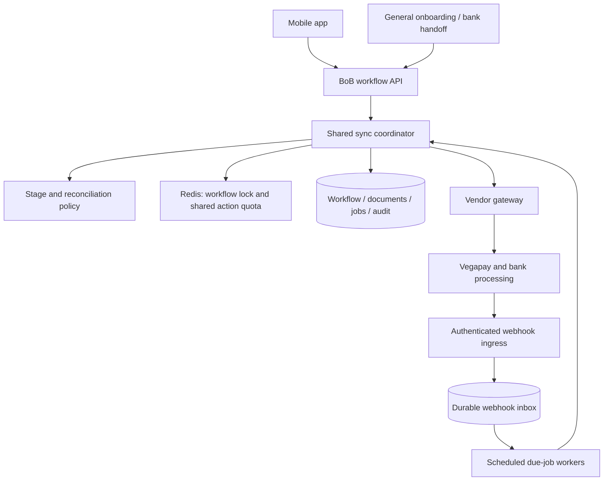
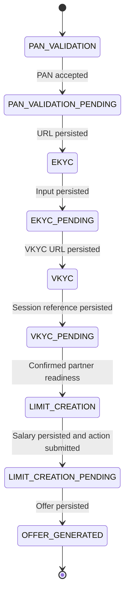

# System design 2: hybrid synchronization, reconciliation and recovery

## 1. Purpose, provenance and interview framing

This is a proposed evolution of the BoB onboarding prototype and the reported Scapia integration. It combines foreground updates, active-user background work and VKYC webhooks through a shared synchronization policy. It is an architecture specification, not a claim that these workers, database tables or recovery policies are already implemented.

The baseline code still provides the domain foundation: input handlers, typed documents, explicit local transitions, stage-aware one-step progression and response preparation. [Design 1](systemdesign1.md) explains that implementation. [ProjectDetails.md](ProjectDetails.md) supplies the wider product/deployment context. This document repeats the important boundaries so it can be read independently.

### Interview opening

> The core problem was reconciling our resumable onboarding state with an asynchronous bank workflow. In the baseline, foreground updates and a VKYC callback triggered that process. My proposed extension gives recently active applications a scheduled reconciliation path, while keeping all triggers behind one state policy and shared action limits. It also specifies stale-observation handling, crash recovery and classified retries.

Use "implemented," "assumed baseline," and "proposed extension" precisely. The sophistication comes from clear ownership and failure semantics; it does not require describing a proposed feature as historical experience.

## 2. Requirements and chosen policies

### Product and ownership

General onboarding owns OTP/profile verification, consented soft bureau checks, bank eligibility and selection. Selecting BoB hands context to the bank engine. That engine owns persisted input, the application mapping, domain transitions, vendor actions and screen data. Vegapay/bank systems own verification and underwriting outcomes.

The larger product journey includes offer acceptance. The prototype's terminal success state is `OFFER_GENERATED`; no new acceptance or underwriting enum is invented here. Card issuance/activation belongs to downstream services. The mobile app executes on a device; the reported backend topology places general onboarding in Scapia cloud and BoB onboarding/Vegapay within bank infrastructure.

### End-to-end product journey

| Stage | Owned behavior |
|---|---|
| General onboarding | Mobile/OTP, name/DOB/PAN capture, identity verification, consented soft bureau check, multi-bank BRE eligibility and bank selection |
| BoB registration | Carry selected-bank context and consent references; register with Vegapay; bind vendor applicationId to local workflow |
| PAN/dedupe | Submit bank confirmation input; accepted result enters pending, correctable decline remains at input |
| EKYC/address | Save current/permanent address and collect SDK verification references; submit requested vendor microstate actions |
| VKYC | Store launch data and session reference; reconcile asynchronous agent/provider completion through polling or callback |
| Limit/underwriting | Stop for required salary input, submit the allowed bank action and observe partner underwriting/sanction |
| Offer | Hydrate/display sanctioned limit; prototype ends at OFFER_GENERATED, while broader product acceptance is outside its enum |

The reported identity rule is one stable customer identity per mobile number, historical rejected/discarded workflows and one eligible active or completed journey at a time. General and initiated bank workflow have a 1:1 handoff mapping. Apply the described 30-day reapplication rule after discard; neither a new workflow nor a return visit resets the customer's action quota.

### Confirmed choices and design defaults

| Item | Policy | Provenance |
|---|---|---|
| Active user | Authenticated GET or UPDATE workflow call in the preceding 12 hours | User-confirmed choice |
| Worker eligibility | Active application in `EKYC_PENDING` or `VKYC_PENDING` | Proposed worker scope |
| Frontend refresh | Existing roughly three-second pending refresh can continue | Reported frontend behavior |
| Partner action cap | Five calls per hour per stable user per action API | User-reported contract |
| Window implementation | Rolling hour, every dispatched attempt counted | Explicit modeling default |
| Partner status cap | No reported API-specific cap on `getStatus` | User-confirmed contract |
| VKYC webhook | Assumed baseline capability; independent of user activity | User-confirmed assumption |
| Mutation lock | Same deterministic Redis workflowId key for every trigger | User-confirmed assumption |
| Inactive recovery | Webhook or next foreground visit; no routine inactive polling | User-confirmed choice |
| Work queue | Durable due-job table and scheduled workers | Proposed prototype-friendly implementation |
| Action acceptance | Current application/state gates the action; obsolete-state calls return out-of-order | User-confirmed partner contract |
| Request-key deduplication / event ordering | Not established by that state gate | Do not assume separate guarantees |
| Status-read coalescing / attempt ledger | Optional traffic and audit tooling | Not required by the primary design |

An active user is not necessarily on screen now. A user who closed the app eleven hours ago is still active under this policy. That is intentional and must be included in the polling cost discussion.

### Correctness and liveness goals

Persist accepted input before relying on later synchronization; apply only permitted local transitions; prepare screen artifacts before exposing the next screen; prevent concurrent local overwrites; avoid replaying actions for states already advanced; honor the action cap across all drivers.

Background freshness is conditional on active eligibility, partner availability, scheduling and quotas. There is no unconditional freshness guarantee for an inactive application whose webhook never arrives. Returning users initiate reconciliation even after the activity window expires.

## 3. High-level architecture



All state-changing paths use the same coordinator and transition rules. A worker has no independent implementation of the workflow. The webhook ingress first preserves delivery; subsequent processing uses that same policy.

One worker invocation performs a bounded step and schedules another due job if appropriate. It does not sleep for minutes or hold a lock across a backoff interval. Delayed work is represented as data.

## 4. Local state, vendor projection and completion boundaries



Rejection is an explicit terminal business outcome available during an ongoing application. Recovery status is additional metadata. Invalid PAN input is rejected synchronously and leaves the input state open, so no backward PAN recovery edge is needed. Undocumented partner recovery does not authorize arbitrary reversal of the journey.

| Local stage | Vendor enum / work | Completion boundary |
|---|---|---|
| `PAN_VALIDATION` | `PAN_VERIFIVATION`: submit validated PAN/DOB; correction is a new input revision | Partner acceptance permits `PAN_VALIDATION_PENDING` |
| `PAN_VALIDATION_PENDING` | `Ekyc_Url_Generated`: obtain next EKYC URL | Store URL, then `EKYC` |
| `EKYC_PENDING` | `Permanent_Address_Details`, `Current_Address_Details`, `Ekyc_Verification`: submit stored prerequisites or requested verification | Remain pending while intermediate work runs |
| `EKYC_PENDING` boundary | `Vkyc`: obtain the VKYC launch URL | Store URL, then `VKYC` |
| `VKYC_PENDING` processing | `Vkyc_Agent_Verification`: observe external processing | Wait or reconcile the completion callback |
| `VKYC_PENDING` boundary | `Limit_Generate`: confirm partner readiness | Enter `LIMIT_CREATION` for salary input |
| `LIMIT_CREATION` | `Limit_Generate`: submit saved salary once allowed | Accepted action permits `LIMIT_CREATION_PENDING` |
| `LIMIT_CREATION_PENDING` | `Offer_Generated`: observe sanction/offer and hydrate data | Store offer, then `OFFER_GENERATED` |
| Ongoing eligible stage | `Application_Rejected`: confirmed business rejection | `REJECTED` and cancel routine jobs |
| Explicit EKYC recovery | `RE_Ekyc_Verification`: classify requested recovery | Recovery policy, not an inferred forward transition |

A stop boundary is a predicate over local prerequisites, current vendor evidence and required artifacts. The enum argument alone is not the proof of completion. At `Limit_Generate`, the action cannot be dispatched until salary exists. At `Vkyc`, saving the launch URL completes an EKYC stage but does not submit the VKYC user's session reference.

### Vendor status contract

| Status | Coordinator decision |
|---|---|
| `PENDING` / code `PNEDING` | Select the compatible current-state action, check stored prerequisites and quota, then dispatch; a repeated applicable pending gate permits another call |
| `IN_PROGRESS` | Submit no corresponding action; persist observation and schedule a later check |
| `FAILED` | Classify error/failed action; choose technical retry, user correction, explicit recovery or investigation |
| State `Application_Rejected` | Confirm the business outcome and apply local rejection; stop normal jobs |

Hours in VKYC processing can be normal according to the supplied experience. The stage age alone is not grounds for rejecting the application. `RE_Ekyc_Verification` is a specific recovery signal, not something to discard using a numerical state rank.

### Confirmed state-gated action acceptance

Vegapay accepts the corresponding action while the application is at its actionable pending state. Successful acceptance moves that state to IN_PROGRESS or later progress. Once it has advanced, a previous-state call returns an out-of-order exception. The gate, not a presumed request-key cache, is the action-acceptance mechanism described by the user.

PAN/DOB validation returns synchronously. An invalid attempt leaves vendor PAN/PENDING and local PAN_VALIDATION open to another corrected or repeated attempt. Success permits the local pending state. A lost success response is recovered by checking current partner progress against the saved submission, not by reopening the form through a speculative backward edge.

The gate does not establish webhook delivery ordering or atomicity of every simultaneous request. The backend still serializes its own drivers and respects action quotas. The mock responses are simplified and do not implement every production gate/error path.

## 5. Low-level responsibilities and interfaces

Keep the existing code's roles, with the shared coordinator extending its stage-bounded progression policy:

| Component | Responsibility in the proposed design |
|---|---|
| WorkflowOrchestrator | Resolve ownership, validate input, request one immediate progression after acceptance and build the latest response |
| WorkflowStateHandlers | Persist typed input and apply stage-specific acceptance, including synchronous PAN validation |
| VegapayProgressionService | Foundation for one status read and a compatible action or boundary transition |
| WorkflowTransitionService | Explicit allowed local edges; no arbitrary jumps across user boundaries |
| VegapayStateHandler / VegapayClient | Vendor actions, artifact retrieval and transport adapters |
| WorkflowResponseBuilder | Render committed local state using saved screen artifacts |
| SyncCoordinator, proposed | Shared fresh-status decision and reconciliation for frontend, worker and webhook |
| ReconciliationPolicy, proposed | Compatibility, prerequisite and required-artifact predicates |
| ActivityTracker, proposed | Authenticated foreground timestamps and 12-hour eligibility |
| Due-job scheduler/repository, proposed | Background cadence, one current job per workflow, claims and stale-job rejection |
| Action quota gateway, proposed | Shared per-user/API admission before every applicable action dispatch |
| WebhookInbox, proposed | Authenticated durable receipt and recoverable processing |
| Optional audit/dispatch recorder | Diagnostics and retry accounting; not an override of an authoritative pending gate |

Illustrative interfaces; no runtime API changes are made here:

```java
enum SyncTrigger { FRONTEND_UPDATE, WORKER, WEBHOOK }
enum SyncOutcome {
    ADVANCED, ACTION_SUBMITTED, WAITING, QUOTA_DEFERRED,
    NEEDS_USER_CORRECTION, NEEDS_RECONCILIATION, TERMINAL
}

SyncResult synchronize(String workflowId, SyncTrigger trigger,
                       Optional<WebhookReceipt> receipt);
Decision decide(WorkflowSnapshot local, VendorObservation observed);
QuotaDecision reserveAction(String customerId, String actionApi,
                            String dispatchAttemptId);
void scheduleBackground(String workflowId, WorkflowState expectedState,
                        long jobGeneration, Instant dueAt);
```

`dispatchAttemptId` identifies one admission/dispatch attempt. Retrying admission for that same attempt need not count twice, while a new outbound retry consumes another slot. This requires atomic quota bookkeeping, not a mandatory business-operation state machine.

The coordinator makes decisions from current vendor state and saved local prerequisites. An optional ACCEPTED/UNKNOWN marker must not automatically prohibit another action that a fresh applicable PENDING gate permits under the reported contract.

## 6. Persistence and invariants

Relational persistence replaces the prototype's in-process repositories in this proposed architecture. This is a logical schema, not a migration.

| Record | Important fields and constraints |
|---|---|
| Customer/application mapping | customer_id, general_workflow_id, workflow_id, application_id; enforce the reported eligible-active-journey rule |
| Workflow | workflow_id, customer_id, application_id, local_state, version, last_vendor_state/status, last_observed_at, recovery_status |
| Step document | workflow_id, state_name, typed payload_json, payload_revision; current document plus retained revision/audit references |
| Activity | workflow_id, last_foreground_at, active_until; atomic maximum timestamp update |
| Background job | workflow_id primary key, expected_state, job_generation, due_at, unchanged_count, lease_until, claim_token |
| Retry metadata | workflow_id, action_api, payload_revision, attempts, retry_at, error_class; bounded accounting where technical retries are used |
| Webhook receipt | provider event ID if trustworthy, application_id, received_at, payload_reference, processing_status |
| Audit | workflow/version, trigger, observed partner state/status, old/new local state, input revision and reason |
| Optional dispatch detail | dispatchAttemptId, action, timestamps, response reference and outcome; diagnostic support |

Index background due time, vendor application mapping and unprocessed receipts. A full accepted/in-flight/unknown operation ledger is optional; it is not needed to implement the state-gated primary path. Shared nextSyncAt and resume markers are optional metadata described later.

Invariants:

1. A next-screen state is committed only with its required artifacts.
2. Local input exists before an action requiring it is dispatched.
3. Saved input proves prerequisites, not successful vendor execution; current compatible vendor evidence establishes progress.
4. Business-state writes use the reread local state and version.
5. All drivers share the stable-user/action API allowance.
6. Workers and callbacks do not renew the foreground activity lease.
7. Missing required input or an unsupported mismatch stops automatic advancement.
8. A successful webhook acknowledgment follows durable receipt or durable application.

Commit related documents, local transition, audit and background-job updates transactionally. The vendor call is outside that transaction. Database version checks and shared locks protect local coordination; partner acceptance is governed by the reported vendor state contract.

## 7. API behavior and submission flow

Keep logical create, GET status and UPDATE status operations. GET returns persisted workflow/screen data and atomically refreshes activity; it does not call Vegapay or change business state. UPDATE processes input or triggers synchronization. Ownership comes from the server's customer/application mapping.

If later implemented, optional `lastSyncedAt`, `retryAfterSeconds` and recovery reason fields can supplement the existing response DTO. These are proposed interface additions, not current fields.

For stale input-free pending requests, return/reconcile from current local state. For stale input, report conflict with the current journey; never interpret an old payload as another stage's input.

### Input and immediate progression

```text
Acquire shared workflow lock; reread local state/version
Obtain current partner status for the state-dependent decision
Reconcile verified existing partner progress before resubmitting old input
Validate the expected input state and typed payload
Persist the submitted prerequisites
    PAN: call synchronous validation only at its applicable gate
         invalid -> remain at input; success -> enter local pending
    Limit: preserve stage-specific action acceptance
    Other input stages: save input and enter pending
Commit accepted local input/state
Run one immediate progression opportunity for the resulting pending stage
Build latest committed workflow response
Release the owned lock in finally
```

The post-submission progression opportunity normally reads partner status once and performs at most one permitted action. Input handlers can already have their own vendor interactions, so the full HTTP request can contain more calls. A modeled out-of-order recovery can add one bounded read; it never becomes an unlimited loop.

The [current orchestrator](src/main/java/org/example/service/WorkflowOrchestrator.java) already demonstrates input dispatch followed by progression and response construction. The assumed lock, generalized recovery-before-resubmission and out-of-order exception policy are broader integration behavior or proposed extensions, not a claim that all are in that method.

If PAN input was saved and its success response was lost, current vendor PAN processing/later progress plus the saved submission can justify catch-up to PAN_VALIDATION_PENDING and the next verified boundary. Do not call PAN again at an obsolete gate. The prototype's input-free input-state update currently does not implement this catch-up; the proposed shared recovery path can do so. Routine worker scope remains EKYC/VKYC.

A failed extra progression step preserves durable accepted input and returns pending/recovery information under the proposed response policy. It must not ask for the form again solely to trigger synchronization.

## 8. Active-user workers and polling frequency

### Eligibility

```text
activeUntil = most recent authenticated GET/UPDATE time + 12 hours
eligibleBackground = localState in {EKYC_PENDING, VKYC_PENDING}
                     and now < activeUntil
                     and not terminal
                     and not blocked by missing input/investigation
```

GET/UPDATE renew foreground activity. Worker execution and callbacks never renew it. After twelve hours without user requests, routine worker polling stops; callback delivery or returning frontend synchronization still works. A returning pending workflow recreates its background job if needed.

### Primary policy: fresh status per admitted trigger

After acquiring the workflow lock and rereading local eligibility, an admitted frontend or worker synchronization fetches current Vegapay status. A worker waiting behind a frontend may make another GET immediately after obtaining ownership. This is accepted overhead: no specific status-API quota was reported. That read determines whether the worker should act, wait or reconcile.

The lock controls overlap, not frequency. It does not suppress sequential reads or replace the action quota. Routine frontend updates retain their roughly three-second cadence; terminal/stale/noneligible work can no-op without an unnecessary vendor call.

A webhook requests current-status reconciliation under the same lock when the event cannot be established as a completed/stale no-op. The primary path does not reuse a mandatory recent-status cache.

### Background cadence defaults

| Condition | Proposed configurable worker schedule |
|---|---|
| Newly eligible EKYC/VKYC stage | Foreground gets its immediate progression opportunity; create subsequent due work |
| EKYC unchanged/processing | 30 seconds, 60 seconds, then 120 seconds maximum |
| VKYC unchanged/processing | 5 minutes, 10 minutes, 20 minutes, then 30 minutes maximum |
| Meaningful vendor progress / accepted intermediate action | Reset background backoff and schedule verification/next work |
| Failed status read | Technical backoff; do not submit an action using an unavailable fresh observation |
| Quota defer | Defer the action until permitted; do not repeatedly dispatch merely because a job is due |
| Expired activity / next user-input state | Remove or suspend routine background work |

Use roughly +/-20% jitter for routine worker checks. Never move a quota or partner retry deadline earlier. Foreground updates do not need to wait for a worker due time. They can fetch status even when an action is temporarily deferred; every attempted action still checks its quota/retry eligibility.

### Durable job execution

1. Claim a due row using a short database lease and unique token.
2. Acquire the workflow lock or defer; no action slot is consumed while waiting.
3. Reread state, twelve-hour activity, recovery status and job generation.
4. Drop stale/ineligible work, then perform one bounded fresh-status step.
5. Commit results and the replacement/cancellation of the background job.
6. Complete only the claimed generation/token so an old worker cannot delete newer work.

Worker due time controls background pacing only. `job_generation` identifies the scheduling decision and is distinct from the workflow version. If the process dies, job-lease expiry permits reclamation; the next execution rereads all eligibility and partner evidence.

A durable database due-job queue is sufficient for the prototype. With a broker later, use an outbox for transactional scheduling and retain consumer deduplication. Do not hold the workflow lock while sleeping for backoff.

## 9. Shared synchronization algorithm and local concurrency

Conceptual primary algorithm; it specifies proposed recovery beyond the current one-step code:

```text
synchronize(workflowId, trigger, receipt):
    acquire owned workflow lock with bounded wait
    try:
        reread local workflow, documents, version and trigger eligibility
        if terminal, already-completed webhook or stale/ineligible worker:
            finish receipt/job as durable no-op where applicable
            return latest local response

        observed = GET current Vegapay status
        decision = reconcile(local, prerequisites, observed)
        if required input missing or mismatch unsupported:
            record divergence; return saved state
        if partner rejection confirmed:
            commit local rejection and cancel work
        else if local milestone catch-up / screen preparation is possible:
            fetch missing response artifacts through permitted recovery APIs
            commit artifacts + allowed transition + audit + job update
        else if applicable action gate is PENDING and prerequisites exist:
            check retry eligibility and shared action quota
            if admitted:
                submit corresponding action using applicationId/state/API
                if out-of-order:
                    GET current status once more; reconcile without replaying old action
                else:
                    record outcome / response artifacts and next local decision
        else if IN_PROGRESS:
            record observation and wait
        else if FAILED:
            classify reason and agreed retry/correction policy

        persist next eligible background due time and receipt outcome
        return latest committed response
    finally:
        release only the owned workflow lock
```

Fresh PENDING permits a repeat call subject to compatibility, prerequisites, retry policy and quota. An optional local attempt marker is diagnostic; it does not supersede this vendor gate. If the out-of-order recovery read cannot establish a safe mapping, return saved waiting/recovery state and allow a future trigger rather than recurse indefinitely.

Every outgoing action, including direct PAN/limit submission and applicable screen preparation, uses the shared quota gateway. Recovery getters use their applicable partner API allowance. Status reads are separately paced by driver behavior.

### Lock and version checks

All business mutations use `lock:bob:workflow:{workflowId}`. Vendor timeouts must fit usable lock ownership; renew when appropriate, release only the owner's token and abort intentional commits on detected ownership loss. Do not hold the lock across a scheduled retry delay.

```sql
UPDATE workflow
SET local_state = :next_state, version = version + 1
WHERE workflow_id = :id
  AND local_state = :expected_state
  AND version = :expected_version;
```

Zero affected rows means the local transition did not commit. Roll back associated local writes and reread. A changed expected version rejects a competing commit; expiry of a Redis lock alone does not change the database version. This is not unconditional database fencing. Hard fencing would require a database-enforced ownership generation.

The lock/version controls our local decisions and writes. Vegapay's gate decides whether the external action is still applicable. Neither fact alone establishes every simultaneous-request or universal exactly-once guarantee.

### Worker/webhook completion race

```mermaid
sequenceDiagram
    participant W as Worker
    participant H as Webhook ingress
    participant I as Durable inbox
    participant C as Coordinator
    participant DB as Workflow store
    W->>C: Synchronize VKYC_PENDING
    C->>DB: Under lock: reread state/version
    H->>I: Persist authenticated event
    Note over H,I: Acknowledge after receipt commit
    C->>DB: Commit LIMIT_CREATION; remove VKYC job
    I->>C: Process completion under same workflow lock
    C->>DB: Reread LIMIT_CREATION
    C->>I: Persist completed no-op receipt
```

If the callback processor wins, the worker drops obsolete work after rereading. If both fresh checks occur sequentially while still eligible, the redundant GET is acceptable. Both completion paths stop at salary input; neither automatically generates a limit.

## 10. Webhook delivery, duplication and order

The repository has no documented webhook wire contract. Use the partner's agreed authentication mechanism; do not invent a particular signature algorithm as historical fact. Map vendor applicationId to the local workflow and validate that the event concerns that application.

Ingress authenticates, durably inserts the receipt and acknowledges after commit. A database failure is not a successful acknowledgment. Processing can then wait for the workflow lock or retry independently. Use a unique vendor event ID if trustworthy; if none is provided, state-level idempotency still handles repeated completion, but delivery-level deduplication is less precise.

Without a guaranteed vendor event sequence or version, a callback is a notification to reconcile current status. Its receive timestamp does not prove business-event order. Fetch current partner status before applying a potentially stale completion or failure. If the partner supplies trustworthy ordering/current-state evidence later, the adapter can use it to avoid unnecessary reads.

A callback can advance an inactive user. It does not grant that user a new 12-hour activity lease or authorize polling all subsequent stages while inactive. A late callback after offer generation must not regress the local state.

## 11. State mismatch and reconciliation

Distinguish a stale frontend request, a stale/late event and a local workflow that missed partner progress. A later observed vendor state need not mean the vendor executed its states out of order; it may mean our response or intermediate observation was lost.

| Observation | Decision |
|---|---|
| Frontend expected state old, no payload | Return/reconcile the latest local stage; never replay old-stage work |
| Old input arrives after local advancement | Conflict/current journey; never treat it as the next stage's payload |
| Current applicable vendor state PENDING | Check local prerequisites and shared quota, then submit its action |
| Another address microstate inside EKYC | Submit the corresponding saved address; remain EKYC_PENDING |
| Vendor IN_PROGRESS | Submit no corresponding action; catch up verified local milestones if necessary, otherwise wait |
| Expected boundary reached | Prepare required artifact, then commit its local edge |
| Vendor beyond a missed boundary | Verify compatible completed milestones and prerequisites; recover artifacts and advance only supported local edges |
| Required input absent | Record divergence; no automatic transition across the missing input boundary |
| Earlier/stale observation | Preserve local progress; verify current status and investigate sustained contradiction |
| Out-of-order action exception | One fresh status read and reconciliation; no business rejection or blind action replay |
| Confirmed vendor rejection | Reject eligible ongoing journey and stop routine work |
| Conflicting terminal observations / unknown state | Preserve evidence and flag investigation; no guessed overwrite or action |
| RE_Ekyc_Verification / undocumented recovery | Use explicit partner/product recovery policy; missing policy stops automatic side effects |

Do not compare enum ordinals. Local and partner states model different things, and recovery branches are not a linear rank. Use explicit predicates combining partner progress, saved input and screen artifacts.

For example, vendor Limit_Generate readiness with a saved VKYC session permits local LIMIT_CREATION, which still requires salary input. Vendor Offer_Generated can justify an offer catch-up only when the application's prerequisites and verified progress support that milestone. If salary input was never saved, flag divergence; do not manufacture it.

PAN correction follows the synchronous contract: invalid PAN/DOB leaves local input and vendor PAN/PENDING available. No PAN_VALIDATION_PENDING-to-PAN_VALIDATION recovery edge is added. An unexpected post-acceptance PAN FAILED is classified using its actual retry contract; it does not silently reopen the form.

If an out-of-order recovery read fails or remains incompatible, preserve the accepted input/local waiting state and retry synchronization on a future trigger. Fetching a new status is a recovery step, not permission for an unlimited GET/action loop.

## 12. Lost responses, artifact hydration and crash recovery

Local persistence and external progress are separate. A lost response leaves our local stage unchanged even though the partner may already be processing the action. The next synchronization always checks current partner truth before deciding whether to call an action again.

### Three recovery checks

1. **Vendor evidence:** what current state/status does this application have, and what completed milestone does that evidence imply under the contract?
2. **Local prerequisites:** is the input required for that milestone saved? Presence alone does not prove a request was sent or accepted.
3. **Response artifacts:** did the lost response contain data needed in local documents or for the next screen? Retrieve it using the partner's specific read/recovery API before committing the new local state.

When the same compatible vendor gate is PENDING, a repeat call is allowed subject to its quota and applicable retry policy. When processing or later progress is confirmed, do not replay the preceding action. A request overtaken between GET and action can return out-of-order; refresh status and reconcile.

### Address example

Both addresses are saved and the local journey is EKYC_PENDING. The permanent-address request succeeds, but its response is lost. Next status requests current address. The backend submits the saved current address and retains EKYC_PENDING. At the VKYC boundary, retrieve/store the launch URL before transitioning to VKYC. Completing one vendor address step does not mean the entire local EKYC stage finished.

If the partner progressed but the required address/session/salary was never saved, this is divergence rather than normal response-loss recovery. Stop automatic advancement and retain evidence.

### Missing artifacts

If a lost response carried an address record, URL or offer data needed locally, use the corresponding partner retrieval capability. Existing prototype examples include getEkycUrl and getLimit; other getters described by the user, such as address retrieval, are contract context rather than all being present in VegapayClient. Distinguish retrieving the existing artifact from replaying an obsolete generation/submission action.

An artifact-recovery call observes its applicable partner allowance. A failed retrieval leaves the user at the waiting local stage; do not expose an empty next screen. Related artifact writes, local transition and audit commit together. Multiple permitted backend edges may be repaired only with explicit compatible milestone evidence and without skipping an input boundary.

| Crash point | Next step |
|---|---|
| Before submitted input is saved | Client can submit again; no accepted local prerequisites exist yet |
| After input save, before partner action | Fresh applicable PENDING permits dispatch with quota |
| After partner acceptance, before response/local update | Fetch status; IN_PROGRESS/later progress drives waiting or catch-up |
| Request/response uncertain, same gate remains PENDING | Repeat permitted action subject to quota; no request-key mechanism required |
| After lost artifact response | Retrieve existing data, persist it, then advance locally |
| After local transition commit, before frontend receives it | GET/reload returns committed journey |
| After webhook receipt commit, before processing | Durable inbox retries processing |
| After background job claim | Claim expires; next worker rereads local eligibility and vendor state |

The confirmed gate makes a detailed accepted/in-flight/unknown ledger unnecessary as the primary lost-response permission mechanism. It does not establish every concurrency/transport guarantee, or make a local transaction atomic with Vegapay. Optional dispatch/audit history can improve diagnosis and retry accounting; it must not override a fresh gate solely because an earlier local outcome is uncertain.

## 13. Action limits and classified retries

### Shared admission

Apply five calls per rolling hour per stable customer and action API. Rolling-hour interpretation is the chosen model, not an established historical implementation. New workflow creation does not reset the user's allowance. Foreground submission, polling action, worker, callback-triggered action and technical retry all use the same admission point.

An atomic Redis reservation removes expired entries, counts the preceding hour and reserves one dispatch token if fewer than five remain. Denial returns the earliest permitted time. An identifier per actual dispatch attempt allows repeated admission checks for that attempt to count once; a new outbound retry counts again. This bookkeeping need not use a full business-operation ledger.

After a crash, conservatively retain an uncertain quota reservation until expiry because the request may have reached the partner. Separate quota accounting from action permission: a fresh PENDING gate can permit a retry, while the quota can still defer it. If quota storage is unavailable, do not perform an action that cannot be accounted for.

Status GET has no reported API-specific cap. In the primary design, both drivers can issue sequential reads. Background cadence and bounded concurrency control the worker contribution; optional coalescing can further reduce traffic. Recovery getters honor their applicable partner API limits.

### Failure policy

| Failure | Decision |
|---|---|
| Synchronous invalid PAN/DOB | Remain at input/vendor pending; corrected or repeated submission subject to quota |
| Action timeout / response lost | Fresh GET first; applicable PENDING permits retry, processing/ahead permits waiting/catch-up |
| Out-of-order action response | One bounded fresh GET and local reconciliation; do not blindly replay or reject |
| Vendor FAILED | Inspect reason and the contract's allowed retry/recovery action; missing mapping stops automatic action |
| Status GET transport/transient error | Preserve local state; later observation retry, no guessed action |
| HTTP 429 | Honor partner guidance and shared allowance; no immediate retry loop |
| Authentication/configuration error | Stop automatic retries and alert integration ownership |
| Business rejection | Apply terminal business outcome |
| Retry budget exhausted / unresolved divergence | Retain input and recovery information; not automatic rejection |

For mapped FAILED recovery, use the specific retry action permitted by the partner. Do not assume every normal action API accepts a FAILED state merely because retries are possible. This classification extends the current progression method, which currently dispatches only for PNEDING.

An illustrative technical budget is the initial action plus at most two automatic retries for one unchanged input revision, with 30-second then 120-second delays and nonnegative jitter. Every attempt still needs fresh state eligibility and quota. User-corrected PAN input is a new input revision, while the same hourly customer/API allowance remains. These defaults are proposed configuration, not reported production numbers.

Routine IN_PROGRESS observations do not consume the technical action retry budget. Worker retries apply only to eligible EKYC/VKYC jobs; PAN/limit synchronization waits for foreground demand. Webhook inbox processing is durable delivery work and is not blocked by user inactivity.

A circuit breaker for sustained technical failure is an optional gateway enhancement. Expected local quota denial is not a partner outage. Preserve the real local state with waiting/retry information; do not introduce an undocumented PROCESSING business enum.

## 14. Optional optimizations, load and observability

### Optional shared status scheduling

A shared nextSyncAt or recent-observation timestamp can reduce redundant GETs. After taking the workflow lock, a caller can return saved state if another trigger recently synchronized and the next check is not yet due. When due, one caller reads status and advances the shared timestamp. New input, actual app return or a meaningful callback can prioritize a fresh check under an explicit policy.

If GET-on-entry is used as a resume signal, optional resume markers may prevent every three-second UPDATE from resetting backoff. This changes freshness/traffic tradeoffs and is not required for the primary fresh-status-per-trigger design. Do not describe coalescing as necessary to make vendor action acceptance safe.

### Optional dispatch history

A detailed dispatch ledger can retain action, input revision, request/response references and timing for auditing, diagnostics, technical retry budgets and quota explanations. Its local ACCEPTED or UNKNOWN flag does not prohibit a call that current partner PENDING explicitly permits. Request-key deduplication is not presumed. Add complexity only when its operational value warrants it.

### Load model

Let F be admitted foreground status requests per second, A_E/A_V the active worker populations and I_E/I_V their average background intervals in seconds. Without coalescing, approximate status load is `F + A_E / I_E + A_V / I_V`, plus callback/recovery reads. Worker and foreground overlap is intentionally counted. Optional shared scheduling reduces the overlapping component.

An on-screen three-second frontend poll can produce roughly 1,200 status calls per hour for that user if every update synchronizes. A 30-minute steady VKYC worker cadence contributes about 24 reads over twelve hours, plus earlier backoff/returns. These are arithmetic illustrations, not measured production traffic. The twelve-hour activity definition therefore still needs a deliberate worker interval.

Actions occur only at applicable gates with input, quota and retry eligibility. Poll frequency does not grant extra action allowance. Background work does not speed up bank processing; it reduces completion-detection delay while eligible.

### Operations and data boundaries

Bound worker concurrency and database claim leases; scale from queue lag and vendor capacity. Preserve bank/scapia deployment boundaries described above. Retain the SDK-only raw Aadhaar boundary, consent/reference audit data and redacted operational logs. These are architectural requirements, not certification claims.

Monitor vendor state/status and stage age, status calls by trigger, action quota deferrals, retries/out-of-order responses, artifact-recovery failures, divergence, webhook delay/duplicates, lock contention, version conflicts, queue lag and expired activity. Audit which current observation and stored prerequisites justified each local transition.

## 15. Implementation sequence and validation

These are proposed runtime changes; this documentation update implements none of them.

1. Preserve existing domain handlers, stop boundaries and response builder while adding persistent local transactions where needed.
2. Apply shared workflow locking, optional version safeguards and common action admission to all mutation paths.
3. Extend stage-aware progression with current-status catch-up, artifact retrieval and bounded out-of-order recovery.
4. Add authenticated durable webhook receipt and shared completion processing.
5. Add twelve-hour foreground activity and due jobs for EKYC/VKYC; enable paced workers behind configuration.
6. Measure status/worker cost; add coalescing or detailed ledgers only if justified.

| Scenario | Expected outcome |
|---|---|
| Synchronous PAN validation invalid | Local PAN input/vendor PAN pending remain open; correction uses same application |
| PAN success response lost | Stored submission plus confirmed partner progress permits local catch-up without obsolete PAN replay |
| Input accepted, immediate progression fails | Saved pending input remains; later trigger needs no repeated form |
| Request not accepted and gate still PENDING | Another quota-limited action call is permitted |
| Partner processing/ahead after response loss | No preceding action replay; wait or reconcile local milestones |
| GET saw PENDING, partner advanced before action | Out-of-order response causes bounded reread/reconciliation |
| Other address now requested | Use its saved input and keep EKYC_PENDING |
| Missing URL/offer response data | Retrieve and persist it before next screen; retrieval failure keeps waiting |
| Vendor ahead, required user input absent | Flag divergence; do not skip boundary |
| Frontend then worker under same lock | Two status GETs are acceptable; each action depends on current gate/quota |
| Worker and callback complete VKYC | One committed LIMIT_CREATION result; second completion no-ops; no limit action |
| Duplicate/late callback or failed ingress persistence | No regression; no success acknowledgment before durability |
| App closes / lease expires | Worker runs only within twelve-hour eligibility; callback or return still recovers |
| Worker or callback executes | Neither refreshes activity |
| Return after missed webhook | Fresh synchronization reconciles and restores background eligibility |
| Five action calls in preceding hour | Sixth deferred across triggers and workflows for that customer/API |
| Classified FAILED/unknown recovery | Use only mapped retry permission; no guessed old-stage dispatch or backward edge |
| Detected lock loss or competing local version | Abort intentional stale work; changed expected version rejects local commit |
| Old job completes after replacement | Claim/generation protects newer job |
| Optional coalescing enabled | Fewer status reads without changing prerequisites or action allowance |

The six existing [prototype tests](src/test/java/org/example/service/WorkflowProgressionTest.java) cover the baseline one-step behavior. This matrix is proposed extension validation, not a claim that these tests or recovery branches already exist.

## 16. Interview grilling and answer checkpoints

Explain the actual contract and the local decision, then its limit.

1. **"What backend complexity exists if the frontend triggers polling?"** Domain projection, saved prerequisites, permitted transitions, screen hydration, resumption, concurrency and partner constraints. Trigger choice does not remove backend ownership.
2. **"Why add a worker?"** Progress during the twelve-hour recent-activity window after app closure. Frontend and webhook remain valid drivers; all use one policy.
3. **"Does the lock eliminate consecutive status reads?"** No. Primary design accepts redundant serialized GETs. Worker cadence controls background cost; coalescing is optional.
4. **"The UI refreshes every three seconds. How many vendor reads?"** Primary design may read on each eligible update, plus paced workers. Give the arithmetic and separately explain action quotas.
5. **"The action response was lost. Can the next request retry?"** Fresh compatible PENDING permits quota-limited retry. Processing/ahead means wait/catch up; no old-stage replay.
6. **"What does Vegapay use instead of request-key deduplication here?"** Its application/current-state gate. Invalid synchronous PAN leaves that gate open; obsolete-state calls return out-of-order. Do not infer every simultaneous-request guarantee.
7. **"What if status was PENDING but another actor advanced it before dispatch?"** Catch out-of-order, GET once more and reconcile. No rejection or blind loop.
8. **"Saved address data proves the request succeeded, right?"** It proves prerequisites. Current compatible partner progression provides acceptance/completion evidence.
9. **"The other address is now pending. Is EKYC complete?"** No. Submit saved corresponding input and remain EKYC_PENDING until the VKYC boundary/artifact is ready.
10. **"Partner is ready but the local URL is missing?"** Retrieve the existing artifact through a supported getter; persist before transitioning. Retrieval failure keeps local waiting state.
11. **"Remote ahead, salary absent. Jump forward?"** Flag divergence and stop at the user boundary; no manufactured input.
12. **"Worker and webhook finish together. What happens?"** Durable receipt, same workflow lock, reread, one eligible local transition and duplicate no-op. Completion stops at salary input.
13. **"Does Redis establish exactly-once remote execution?"** No. Explain local serialization and precise version limits; vendor gating handles action applicability, without inventing unconfirmed guarantees.
14. **"What makes a user active?"** Authenticated GET/UPDATE in the last twelve hours. Worker/callback do not renew that window.
15. **"What if an inactive user's webhook is lost?"** No continuous inactive freshness guarantee. Foreground return triggers current-status recovery.
16. **"Does FAILED mean repeat any API?"** Classify reason and supported retry action. Unmapped failure needs investigation, not guessed dispatch or business rejection.
17. **"What does a PAN correction change?"** New user input revision while the same vendor gate is open. Same customer/action quota; no special deduplication identity required.
18. **"Which parts exist in code?"** One-step orchestration and typed stored-data projection. Locks/webhook are assumed baseline; generalized recovery/workers/durable receipt are proposed; ledger and coalescing optional.

### Recovery scenario to rehearse

The user submitted both addresses. Permanent-address action reached Vegapay, but its response was lost. Local workflow remains EKYC_PENDING. On the next request:

- Current-address/PENDING: submit its saved input and remain in local EKYC pending.
- Same applicable permanent-address/PENDING: a quota-limited repeat is allowed by the gate.
- Processing: submit no corresponding action; wait.
- VKYC boundary: retrieve/store its launch URL, then transition locally.
- Advanced milestone with required input missing: preserve state and flag divergence.
- Action overtaken after the read: out-of-order response triggers bounded fresh reconciliation.

Explain why the local form is not collected again and why saved input alone is not proof of the earlier request's success.

## 17. Source map and comparison

Sources: [ProjectDetails](ProjectDetails.md), [WorkflowOrchestrator](src/main/java/org/example/service/WorkflowOrchestrator.java), [input handlers](src/main/java/org/example/service/WorkflowStateHandlers.java), [progression](src/main/java/org/example/service/VegapayProgressionService.java), [transitions](src/main/java/org/example/service/WorkflowTransitionService.java), [response builder](src/main/java/org/example/service/WorkflowResponseBuilder.java), [vendor handlers](src/main/java/org/example/vegapay/statehandlers/VegapayStateHandler.java), [vendor states](src/main/java/org/example/vegapay/VegapayWorkflowState.java), [vendor statuses](src/main/java/org/example/vegapay/VegapayWorkflowStateStatus.java).

| Dimension | Design 1 | Design 2 |
|---|---|---|
| Drivers | Frontend and assumed VKYC callback | Same plus active EKYC/VKYC worker jobs |
| Action acceptance | Confirmed partner state gate | Same gate, shared prerequisites and quota |
| Status traffic | Foreground fresh reads | Fresh reads per eligible trigger; worker cadence; coalescing optional |
| Local concurrency | Assumed workflow Redis lock | Same lock plus proposed transactions/version checks |
| Lost responses | Contract recovery described; prototype exact-boundary limitation | Explicit current-state catch-up and artifact restoration |
| Webhook processing | Assumed eligible completion under lock | Durable receipt and shared recovery/application policy |
| Retries | Corrected PAN and reported hourly limits | Classified retry permission, same hourly cap and bounded recovery |
| Detailed dispatch ledger | Not required | Optional diagnostics/accounting |
| Inactive freshness | Callback or next frontend visit | Same after twelve-hour activity expiry |

The worker changes when reconciliation runs. The partner gate, local prerequisites, screen artifacts and permitted transitions determine what may happen.
